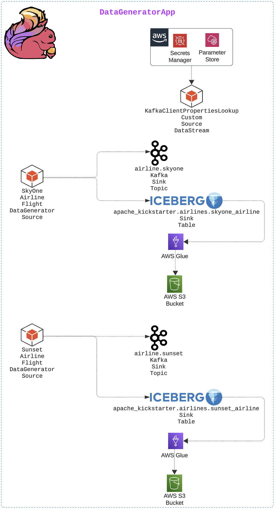
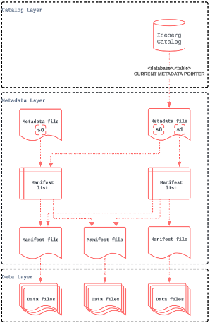
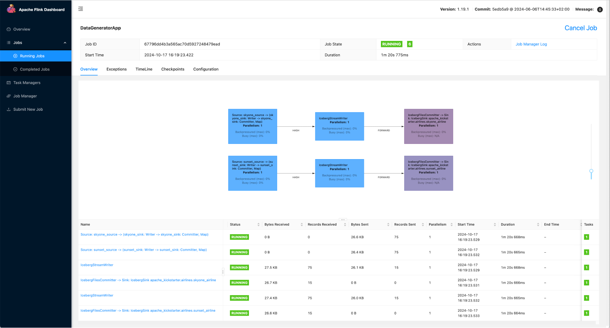

# Apache Iceberg in Action with Apache Flink using Java
Data engineering transforms raw data into useful, accessible data products in the Data Mesh platform-building era. Like the signalRoom GenAI Data Mesh platform, we package our data products in Apache Iceberg tables. In this article, I’ll take you through sinking your Apache Flink data into Apache Iceberg tables using Java. This is a natural follow-up to my previous short piece, [Apache Flink + Apache Iceberg + AWS Glue: Get Your JAR Versions Right!](get-your-jar-versions-right.md) where I listed out the right combination of JARs to use.

In this article, I’ll walk you through how to seamlessly sink data in your Flink application to Apache Iceberg tables using AWS Glue as your Apache Iceberg catalog, ensuring reliability, performance, and future-proof data storage. We will do this using the [Apache Flink Kickstarter Data Generator Flink app](https://github.com/j3-signalroom/apache_flink-kickstarter/blob/main/java/app/src/main/java/kickstarter/DataGeneratorApp.java). This app generates synthetic flight data for two fictional airlines (`Sunset Air` and `SkyOne`) and streams it into Apache Kafka and Apache Iceberg. The app provides real-time and historical analytics capabilities, demonstrating the power of Apache Iceberg as a table format for large, complex analytic datasets in distributed data lakehouses. Moreover, it illustrates how AWS Glue is used as the metadata catalog for the Apache Iceberg tables.



The plan for the remainder of the article is as follows:


- What is Apache Iceberg, and why is it a game-changer for data platform architecture?
- How to set up AWS Glue to use it as your Apache Iceberg catalog.
- Step-by-step walkthrough of Data Generator Flink App that puts it all together.

## What is Apache Iceberg?
Apache Iceberg was created in 2017 by Netflix’s Ryan Blue and Daniel Weeks. It is an open table format designed to resolve the deficiencies of working with data lakes, especially those on distributed storage systems like Amazon S3, Google Cloud Storage, and Azure Blob Storage. A table format is a method of structuring a dataset’s files to present them as a unified “table.” From the user’s perspective, it can be defined as the answer to the question, “What data is in this table?” However, to implement a table format on a distributed storage system, Apache Iceberg needed to overcome several challenges posed by distributed storage systems (e.g., S3, Google Cloud Storage, and Azure Blob Storage):

Problem|Challenge|Impact|Solution
-|-|-|-
**Lack of Consistency and ACID Guarantees**|Distributed storage systems are typically designed for object storage, not traditional database operations. This leads to issues with consistency, especially during concurrent read and write operations.|Without ACID (Atomicity, Consistency, Isolation, Durability) guarantees, operations like updates, deletes, and inserts can become error-prone, leading to inconsistent data views across different sessions or processes.|Apache Iceberg provides ACID compliance, ensuring reliable data consistency on distributed storage systems.
**Bloated Metatdata Files and Slow Query Performance**|As datasets grow in size, so does the metadata (file paths, schema, partitions) associated with them. Efficiently querying large volumes of metadata can become slow and inefficient.|Simple operations like listing files in a directory can become time-consuming, affecting the performance of queries and applications.|Apache Iceberg organizes data into partitions and adds metadata layers, reducing the need to scan the entire dataset and optimizing query performance. This approach allows for filtering data at the metadata level, which avoids loading unnecessary files.
**Lack of Schema Evolution and Data Mutability**|Analytic datasets often require schema changes (e.g., adding or renaming columns) as business requirements evolve. Distributed storage formats typically lack built-in support for handling schema changes efficiently.|Without schema evolution support, datasets require complex data transformations or complete rewrites, which can be slow and resource-intensive.|Apache Iceberg allows schema changes without reprocessing the entire dataset, making it easy to add new fields or alter existing ones over time.
**Inefficient Partitioning and Data Skipping**|Distributed storage systems don't natively support data partitioning, which is crucial for optimizing queries on large datasets.|Lack of partitioning increases query latency because the system has to scan more data than necessary.|Apache Iceberg allows hidden partitioning and metadata-based pruning, ensuring queries only read the required partitions, reducing scan times and improving performance.
**Lack of Data Versioning and Time Travel**|Many analytic workflows need to access previous data versions for tasks like auditing, debugging, or historical analysis. Distributed storage doesn’t offer built-in support for versioning.|Maintaining multiple versions of the same dataset becomes cumbersome, especially without efficient version control, and can lead to excessive storage costs.|Apache Iceberg offer time travel, allowing users to access snapshots of data at different points in time, providing easy access to historical data.
**Unable to do Concurrent Read and Write Operations**|Large analytic workloads often involve multiple processes reading from and writing to the same data simultaneously. Distributed storage systems do not inherently support these concurrent operations smoothly.|Without proper handling, this can lead to data corruption or version conflicts, especially during high-throughput operations.|Apache Iceberg’s transactional model enables concurrent operations safely by managing snapshots and transactions, ensuring data integrity and consistency.
**Too Many Small Files**|Distributed storage systems can accumulate many small files over time due to frequent appends or updates.|Small files lead to inefficient I/O operations and high metadata costs, degrading query performance and increasing storage costs.|Apache Iceberg handles file compaction as part of data maintenance routines, merging small files into larger ones to optimize storage and access efficiency.

By addressing these challenges, the Apache Iceberg table format enables scalable, high-performance, easy-to-use, and lower-cost data lakehouse solutions (the successor to data lakes). These solutions combine the best of data warehouse and data lake design and leverage distributed storage for both analytic and streaming workloads.

With the challenges resolved by Apache Iceberg when working on a distributed storage system, the question arises: how does it manage the metadata? This is where Apache Iceberg utilizes an engine (i.e., catalog), such as **AWS Glue**, **Hive Megastore**, or **Hadoop** filesystem catalog, to track a table’s partitioning, sorting, and schema over time, and so much more using a tree of metadata that an engine can use to plan queries in a fraction of the time it would take with legacy data lake patterns.



This metadata tree breaks down the metadata of the table into four components:

- **Manifest file:** A list of data files containing each data file’s location/path and key metadata about those data files, which allows for creating more efficient execution plans.
- **Manifest list:** Files that define a single snapshot of the table as a list of manifest files and stats on those manifests that allow for creating more efficient execution plans.
- **Metadata file:** Files that define a table’s structure, including its schema, partitioning scheme, and a listing of snapshots.
- **Catalog:** This tool tracks the table location (similar to the Hive Metastore), but instead of containing a mapping of table name -> set of directories, it includes a mapping of table name -> location of the table’s most recent metadata file. Several tools, including a Hive Metastore, can be used as a catalog.

### Why Apache Iceberg is a Game-changer?
The true power of Apache Iceberg is that it allows for the separation of storage from compute. This means we are **NO LONGER LOCKED INTO** a single data vendor’s compute engine (e.g., Hive, **Flink**, Presto, **Snowflake**, **Spark**, and Trino)! We store the data independently of the compute engine in our distributed storage system (e.g., Amazon S3, Google Cloud Storage, and Azure Blob Storage). Then, we connect to the compute engine that best fits our use case for whatever situation we use our data in! Moreover, we could have one copy of the data and use different engines for different use cases. Now, let that sit with you!


> Imagine the freedom to choose the most cost-effective solution every time you process your data. Whether Apache Flink is more budget-friendly than Snowflake or vice versa, you have the power to decide! Your data isn’t locked into any specific compute engine, giving you ultimate flexibility to optimize for both performance and cost.


## AWS Glue for your Apache Iceberg Catalog
**AWS Glue** is a fully managed extract, transform, and load (ETL) service offered by Amazon Web Services (AWS). It simplifies preparing and loading data for analytics by automating data discovery, schema inference, and job scheduling. In addition, the AWS Glue Data Catalog serves as a centralized metadata repository for Apache Iceberg Tables.

The easiest way to set up AWS Glue in your environment — assuming AWS is your cloud provider — is to use Terraform. I primarily choose Terraform because it is essential for implementing CI/CD (Continuous Integration/Continuous Development) in any environment. This approach ensures that infrastructure deployment is scalable, repeatable, and manageable.

Below is a step-by-step guide with Terraform code to establish the necessary infrastructure for integrating AWS Glue and Amazon S3 with Apache Iceberg. This setup is designed to store Apache Iceberg tables in S3, manage metadata through AWS Glue, and ensure that the appropriate IAM roles and policies are in place for permissions:

### Step 1 of 5. Create the `<YOUR-UNIQUE-BUCKET-NAME>` S3 Bucket for Apache Iceberg Tables
```hcl
resource "aws_s3_bucket" "iceberg_bucket" {
  bucket = <YOUR-UNIQUE-BUCKET-NAME>
}
```

### Step 2 of 5. Create the `warehouse/` Folder Object within the S3 Bucket
```hcl
resource "aws_s3_object" "warehouse" {
  bucket = aws_s3_bucket.iceberg_bucket.bucket
  key    = "warehouse/"
}
```

### Step 3 of 5. IAM Role for AWS Glue
```hcl
resource "aws_iam_role" "glue_role" {
  name = "glue_service_role"
  assume_role_policy = jsonencode({
    "Version": "2012-10-17",
    "Statement": [
      {
        "Effect": "Allow",
        "Principal": {
          "Service": "glue.amazonaws.com"
        },
        "Action": "sts:AssumeRole"
      }
    ]
  })
}
```

### Step 4 of 5. IAM Policy for S3 Access
```hcl
resource "aws_iam_policy" "glue_s3_access_policy" {
  name = "GlueS3AccessPolicy"  policy = jsonencode({
    "Version": "2012-10-17",
    "Statement": [
      {
        "Effect": "Allow",
        "Action": [
          "s3:GetObject",
          "s3:PutObject",
          "s3:ListBucket"
        ],
        "Resource": [
          aws_s3_bucket.iceberg_bucket.arn,
          "${aws_s3_bucket.iceberg_bucket.arn}/*"
        ]
      }
    ]
  })
}
```

### Step 5 of 5. Attach IAM Policy to the AWS Glue Role
```hcl
resource "aws_iam_role_policy_attachment" "glue_policy_attachment" {
  role       = aws_iam_role.glue_role.name
  policy_arn = aws_iam_policy.glue_s3_access_policy.arn
}
```

This Terraform code is essential for setting up an **AWS S3 Bucket**, **AWS Glue**, and **Apache Iceberg** infrastructure. It is designed for managing metadata, storing data files in S3, and granting permissions for AWS Glue to handle the lifecycle of Apache Iceberg Tables. This setup is ideal for implementing data lakehouse solutions that require efficient metadata management and seamless integration with AWS services.

## Putting it all together with the Data Generator Flink App
This app, [DataGeneratorApp](https://github.com/j3-signalroom/apache_flink-kickstarter/blob/main/java/app/src/main/java/kickstarter/DataGeneratorApp.java), is a comprehensive example of a Flink application that generates synthetic flight data for two fictional airlines (`Sunset Air` and `SkyOne`), and sinks the data to Kafka topics and Apache Iceberg Tables, providing real-time and historical analytics capabilities. It uses Apache Flink to build a streaming pipeline with the **Flink DataStream API** and **Apache Iceberg** integration using **AWS Glue**. Below is the step-by-step breakdown of the code:

### Step 1 of 12. Import classes.
```java
package kickstarter;

import org.apache.flink.api.common.eventtime.WatermarkStrategy;
import org.apache.flink.api.common.functions.MapFunction;
import org.apache.flink.api.common.typeinfo.Types;
import org.apache.flink.api.connector.source.util.ratelimit.RateLimiterStrategy;
import org.apache.flink.connector.base.DeliveryGuarantee;
import org.apache.flink.connector.datagen.source.DataGeneratorSource;
import org.apache.flink.connector.kafka.sink.*;
import org.apache.flink.formats.json.JsonSerializationSchema;
import org.apache.flink.streaming.api.datastream.*;
import org.apache.flink.streaming.api.environment.*;
import org.apache.flink.table.api.*;
import org.apache.flink.table.api.bridge.java.StreamTableEnvironment;
import org.apache.flink.table.data.*;
import org.apache.flink.table.types.logical.*;
import org.apache.flink.types.*;
import org.apache.flink.table.catalog.*;
import org.apache.iceberg.catalog.*;
import org.apache.iceberg.flink.*;
import org.apache.iceberg.flink.sink.FlinkSink;
import org.apache.hadoop.conf.Configuration;
import java.util.*;
import org.slf4j.*;

import kickstarter.model.*;
```

- Since [`AirlineData`](https://github.com/j3-signalroom/apache_flink-kickstarter/blob/main/java/app/src/main/java/kickstarter/model/AirlineData.java) Java POJO will be used in the code later, we **`import kickstarter.model.*`**

```java
public class DataGeneratorApp {
    private static final Logger logger = LoggerFactory.getLogger(DataGeneratorApp.class);


 /**
  * The main method in a Flink application serves as the entry point of the program, where
  * the Flink DAG is defined.  That is, the execution environment, the creation of the data
  * streams or datasets, apply transformations, and trigger the execution of the application (by
  * sending it to the Flink JobManager).
  * 
  * @param args list of strings passed to the main method from the command line.
  * @throws Exception - The exceptions are forwarded, and are caught by the runtime.  
  * When the runtime catches an exception, it aborts the task and lets the fail-over logic
  * decide whether to retry the task execution.
  */
  public static void main(String[] args) throws Exception {
    ...
  }
}
```
- Place the code in steps 2 through 11 in the **`main()`** method, except for the **`SinkToIcebergTable()`** which goes out of the main() method but stays with the **`DataGeneratorApp`** class.

### Step 2 of 11. Retrieve Command-Line Arguments for the Application
```java
String serviceAccountUser = Common.getAppArgumentValue(args, Common.ARG_SERVICE_ACCOUNT_USER);
String awsRegion = Common.getAppArgumentValue(args, Common.ARG_AWS_REGION);
```

- Use [`Common.getAppArgumentValue()`](https://github.com/j3-signalroom/apache_flink-kickstarter/blob/main/java/app/src/main/java/kickstarter/Common.java) helper methods to retrieve the `serviceAccountUserwhich` contains the S3 bucket name and `awsRegion` which contains the AWS region name from the command-line of the app, respectively.

### Step 3 of 11. Set Up Flink Execution Environment
```java
StreamExecutionEnvironment env = StreamExecutionEnvironment.getExecutionEnvironment();
env.enableCheckpointing(5000);  // Enables checkpointing every 5 seconds to ensure fault tolerance
env.getCheckpointConfig().setCheckpointTimeout(60000);  // Sets a timeout of 60 seconds for each checkpoint
env.getCheckpointConfig().setMaxConcurrentCheckpoints(1);  // Ensuring that only one checkpoint is taken at a time
EnvironmentSettings settings = EnvironmentSettings.newInstance().inStreamingMode().build();
StreamTableEnvironment tblEnv = StreamTableEnvironment.create(env, settings);
```

- **Stream Execution Environment:** Creates the Flink `StreamExecutionEnvironment`, which represents the Flink job's DAG (Directed Acyclic Graph) and enables typical Apache Flink checkpointing settings.

> _[Apache Flink Checkpointing](https://nightlies.apache.org/flink/flink-docs-master/docs/dev/datastream/fault-tolerance/checkpointing/#:~:text=Checkpoints%20allow%20Flink%20to%20recover,Flink's%20streaming%20fault%20tolerance%20mechanism.) is a fault-tolerance mechanism that enables stateful stream processing applications to recover from failures while maintaining exactly-once processing semantics._

- **Table Environment:** Creates a `StreamTableEnvironment (tblEnv)` to work with Flink's Table API, which allows for SQL-like operations and integration with other data processing systems.

### Step 4 of 11. Retrieve Producer Kafka Client Properties
> _This article focuses on Apache Iceberg with AWS Glue Data Catalog and Apache Flink, so I did not cover Confluent Cloud, AWS Secrets, or AWS Systems Manager Parameter Store. For related code, see [`aws-resources.tf`](https://github.com/j3-signalroom/apache_flink-kickstarter/blob/main/aws-resources.tf)._

```java
DataStream<Properties> dataStreamProducerProperties = 
    env.fromData(new Properties())
       .map(new ConfluentClientConfigurationLookup(false, serviceAccountUser))
       .name("kafka_producer_properties");
Properties producerProperties = new Properties();

try {
    dataStreamProducerProperties
        .executeAndCollect()
        .forEachRemaining(typeValue -> {
            producerProperties.putAll(typeValue);
        });
} catch (final Exception e) {
    System.out.println("The Flink App stopped during the reading of the custom data source stream because of the following: " + e.getMessage());
    e.printStackTrace();
    System.exit(1);
}
```

- **Kafka Properties Lookup:** Uses [`ConfluentClientConfigurationLookup`](https://github.com/j3-signalroom/apache_flink-kickstarter/blob/main/java/app/src/main/java/kickstarter/ConfluentClientConfigurationLookup.java) to fetch the Producer Kafka Client properties (e.g., broker addresses, security settings) from AWS services (like AWS Secrets Manager). This is a custom source data stream I built, which I will explain in a later post!

- **Create DataStream:** Creates a `DataStream<Properties>` that contains the Kafka producer properties.

> _What is a [DataStream](https://nightlies.apache.org/flink/flink-docs-master/docs/dev/datastream/overview/)?_
> 
> _The `DataStream API` gets its name from the special `DataStream` class that is used to represent a collection of data in a Flink program. You can think of them as immutable collections of data that can contain duplicates. This data can be finite or unbounded; the API you use to work on them is the same._
>
> _A `DataStream` is similar to a regular Java Collection in terms of usage but is quite different in some key ways. They are immutable, meaning that once they are created, you cannot add or remove elements. You can also not simply inspect the elements inside but only work on them using the `DataStream API` operations, which are also called transformations._

- **Execute and Collect:** Adds newly created Producer Kafka Client Properties (`producerProperties`) to the DAG to ensure they can set up the Kafka sinks.
- **Error Handling:** If any exception occurs during this process, the application prints the error, logs it, and exits a non-zero status.

### Step 5 of 11. Create fictional airline Data Sources and add them to the DAG

**Sky One Source:**

```java
DataGeneratorSource<AirlineData> skyOneSource =
    new DataGeneratorSource<>(
        index -> DataGenerator.generateAirlineFlightData("SKY1"),
        Long.MAX_VALUE,
        RateLimiterStrategy.perSecond(1),
        Types.POJO(AirlineData.class)
    );
DataStream<AirlineData> skyOneStream = 
    env.fromSource(skyOneSource, WatermarkStrategy.noWatermarks(), "skyone_source");
```

- **Data Generator for Sky One:**  Generates synthetic flight data (`AirlineData`) for `SkyOne` airline using `DataGeneratorSource`. The generator runs indefinitely (`Long.MAX_VALUE`) and generates one record per second (`RateLimiterStrategy.perSecond(1)`).
- **Create Data Stream:**  Converts the data source into a `DataStream<AirlineData>` named `skyOneStream`.

**Sunset Source:**
  
```java
DataGeneratorSource<AirlineData> sunsetSource =
    new DataGeneratorSource<>(
        index -> DataGenerator.generateAirlineFlightData("SUN"),
        Long.MAX_VALUE,
        RateLimiterStrategy.perSecond(1),
        Types.POJO(AirlineData.class)
    );
DataStream<AirlineData> sunsetStream = 
    env.fromSource(sunsetSource, WatermarkStrategy.noWatermarks(), "sunset_source");
```

- **Data Generator for Sunset Air:**  Similarly, creates a data generator for `Sunset Air` airline.
- **Create Data Stream:**  Converts the data source into a `DataStream<AirlineData>` named `sunsetStream`.

### Step 6 of 11. Create Kafka Sinks and them to the DAG
> _This article focuses on Apache Iceberg with AWS Glue Data Catalog and Apache Flink, so I did not cover Confluent Cloud, AWS Secrets, or AWS Systems Manager Parameter Store. For related code, see [`confluent-resources.tf`](https://github.com/j3-signalroom/apache_flink-kickstarter/blob/main/confluent-resources.tf)._

**Sky One Sink:**
```java
KafkaRecordSerializationSchema<AirlineData> skyOneSerializer = 
    KafkaRecordSerializationSchema.<AirlineData>builder()
        .setTopic("airline.skyone")
        .setValueSerializationSchema(new JsonSerializationSchema<>(Common::getMapper))
        .build();

KafkaSink<AirlineData> skyOneSink = 
    KafkaSink.<AirlineData>builder()
        .setKafkaProducerConfig(producerProperties)
        .setRecordSerializer(skyOneSerializer)
        .setDeliveryGuarantee(DeliveryGuarantee.AT_LEAST_ONCE)
        .build();
skyOneStream.sinkTo(skyOneSink).name("skyone_sink");
```

- **Serialization Schema:** Creates a serialization schema for `SkyOne` using `JsonSerializationSchema`, which converts AirlineData objects to JSON format.
- Configures a Kafka sink (`KafkaSink<AirlineData>`) with the producer properties retrieved earlier.
- Uses `AT_LEAST_ONCE` delivery guarantee to ensure that messages are not lost, although duplicates may be possible.
- Attach Sink: Add the `KafkaSink` to the DAG.

**Sunset Sink:**
```java
KafkaRecordSerializationSchema<AirlineData> sunsetSerializer = 
    KafkaRecordSerializationSchema.<AirlineData>builder()
        .setTopic("airline.sunset")
        .setValueSerializationSchema(new JsonSerializationSchema<>(Common::getMapper))
        .build();
KafkaSink<AirlineData> sunsetSink = 
    KafkaSink.<AirlineData>builder()
        .setKafkaProducerConfig(producerProperties)
        .setRecordSerializer(sunsetSerializer)
        .setDeliveryGuarantee(DeliveryGuarantee.AT_LEAST_ONCE)
        .build();
sunsetStream.sinkTo(sunsetSink).name("sunset_sink");
```

- **Serialization Schema:**  Similarly, creates a serializer for the `Sunset Air` data to be published to the `airline.sunset` topic.
- **Kafka Sink:**  Sets up the Kafka sink for `Sunset Air` with the same configurations as `SkyOne`.
- Uses `AT_LEAST_ONCE` delivery guarantee to ensure that messages are not lost, although duplicates may be possible.
- **Attach Sink:**  Add the `KafkaSink` to the DAG.

> _Only streams with sinks attached will be executed when the `StreamExecutionEnvironment.execute()` the method is called._

### Step 7 of 11. Configure, Register, and Set the Apache Iceberg Catalog
```java
String catalogName = "apache_kickstarter";
String bucketName = serviceAccountUser.replace("_", "-");  // --- To follow S3 bucket naming convention, replace underscores with hyphens if exist in string.
String catalogImpl = "org.apache.iceberg.aws.glue.GlueCatalog";
String databaseName = "airlines";
Map<String, String> catalogProperties = new HashMap<>();
catalogProperties.put("type", "iceberg");
catalogProperties.put("warehouse", "s3://" + bucketName + "/warehouse");
catalogProperties.put("catalog-impl", catalogImpl);
catalogProperties.put("io-impl", "org.apache.iceberg.aws.s3.S3FileIO");
catalogProperties.put("glue.skip-archive", "true");
catalogProperties.put("glue.region", awsRegion);
CatalogDescriptor catalogDescriptor = CatalogDescriptor.of(catalogName, org.apache.flink.configuration.Configuration.fromMap(catalogProperties));
tblEnv.createCatalog(catalogName, catalogDescriptor);
tblEnv.useCatalog(catalogName);
org.apache.flink.table.catalog.Catalog catalog = tblEnv.getCatalog(catalogName).orElseThrow(() -> new RuntimeException("Catalog not found"));

// --- Print the current catalog name.
System.out.println("Current catalog: " + tblEnv.getCurrentCatalog());
```

**Configure the Apache Iceberg Catalog:**
- **catalogName:** The name of the Iceberg catalog (`apache_kickstarter`), which will reference this catalog in the Flink environment.
- **bucketName:** The S3 bucket where the data will be stored. The code ensures the bucket name follows S3 naming conventions by replacing underscores (`_`) with hyphens (`-`).
- **catalogImpl:** The implementation class for the Iceberg catalog (`org.apache.iceberg.aws.glue.GlueCatalog`). This means that AWS Glue will be used for metadata management.
- **databaseName:** The database within the catalog (`airlines`), which will store related tables.
- **catalogProperties map type:** Defines the catalog type as `iceberg`.
- **catalogProperties map warehouse:** Specifies the warehouse location in S3 (`s3://<bucketName>/warehouse`). This is where Apache Iceberg Tables' data will be stored.
- **catalogProperties map catalog-impl:** Specifies the implementation (`GlueCatalog`) to use for managing metadata.
- **catalogProperties map io-impl:** Specifies the I/O implementation (`S3FileIO`) to read from and write to Amazon S3.
- **catalogProperties map glue.skip-archive:** By setting `"true"`, Glue can skip archiving old table metadata, making operations faster.
- **catalogProperties map glue.region:** Sets the AWS region for AWS Glue.

**Register and Set the Apache Iceberg Catalog:**
- **CatalogDescriptor:** Registers the Apache Iceberg Catalog with Flink using the above catalog properties.
- **tblEnv.createCatalog(catalogName, catalogDescriptor):** Registers the catalog with the specified name (`catalogName`) in the `StreamTableEnvironment (tblEnv)`. This makes the catalog available for use within the Flink environment.
- **tblEnv.useCatalog(catalogName):** Sets the newly created catalog as the current one in use, meaning any subsequent table-related commands will reference this one.

### Step 8 of 11. Check if the Apache Flink Catalog Database Exists and Create It if it Does Not
> _What is an Apache Flink Catalog Database?_
>
> _The Apache Flink catalog database is a logical namespace that stores metadata about data sources, including databases, tables, and views. The catalog provides a unified API for managing metadata accessible from the Table API and SQL Queries._
  
```java
try {
    if (!catalog.databaseExists(databaseName)) {
        catalog.createDatabase(databaseName, new CatalogDatabaseImpl(new HashMap<>(), "The Airlines flight data database."), false);
    }
    tblEnv.useDatabase(databaseName);
} catch (Exception e) {
    System.out.println("A critical error occurred during the processing of the database because " + e.getMessage());
    e.printStackTrace();
    System.exit(1);
}

// --- Print the current database name.
System.out.println("Current database: " + tblEnv.getCurrentDatabase());
```

### Step 9 of 11. Define the `RowType` for the `RowData`
```java
RowType rowType = RowType.of(
    new LogicalType[] {
        DataTypes.STRING().getLogicalType(),
        DataTypes.STRING().getLogicalType(),
        DataTypes.STRING().getLogicalType(),
        DataTypes.STRING().getLogicalType(),
        DataTypes.STRING().getLogicalType(),
        DataTypes.BIGINT().getLogicalType(),
        DataTypes.STRING().getLogicalType(),
        DataTypes.STRING().getLogicalType(),
        DataTypes.DECIMAL(10, 2).getLogicalType(),
        DataTypes.STRING().getLogicalType(),
        DataTypes.STRING().getLogicalType()
    },
    new String[] {
        "email_address",
        "departure_time",
        "departure_airport_code",
        "arrival_time",
        "arrival_airport_code",
        "flight_duration",
        "flight_number",
        "confirmation_code",
        "ticket_price",
        "aircraft",
        "booking_agency_email"
    }
);
```

- **`RowType`:** Defines the schema for the rows of data that will be used in the Flink data stream and written to Iceberg tables.

### Step 10 of 11. Call the `SinkToIcebergTable()` helper method for both DataStreams
```java
// --- Use the CatalogLoader since AWS Glue Catalog is used as the external metastore.
CatalogLoader catalogLoader = CatalogLoader.custom(catalogName, catalogProperties,  new Configuration(false), catalogImpl);

// --- Sink the datastreams to their respective Apache Iceberg tables.
SinkToIcebergTable(tblEnv, catalog, catalogLoader, databaseName, rowType.getFieldCount(), "skyone_airline", skyOneStream);
SinkToIcebergTable(tblEnv, catalog, catalogLoader, databaseName, rowType.getFieldCount(), "sunset_airline", sunsetStream);
```

- **Catalog Loader:** This indicates that Apache Iceberg uses Flink as its compute engine, while AWS Glue serves as the Catalog managing the metadata and data/delete files for Apache Iceberg.

```java
/**
 * This method is used to sink the data from the input data stream into the iceberg table.
 * 
 * @param tblEnv The StreamTableEnvironment.
 * @param catalog The Catalog. 
 * @param catalogLoader The CatalogLoader.
 * @param databaseName  The name of the database.
 * @param fieldCount The number of fields in the input data stream.
 * @param tableName The name of the table. 
 * @param airlineDataStream The input data stream.
 */
private static void SinkToIcebergTable(final StreamTableEnvironment tblEnv, final org.apache.flink.table.catalog.Catalog catalog, final CatalogLoader catalogLoader, final String databaseName, final int fieldCount, final String tableName, DataStream<AirlineData> airlineDataStream) {
    // --- Convert DataStream<AirlineData> to DataStream<RowData>
    DataStream<RowData> skyOneRowData = airlineDataStream.map(new MapFunction<AirlineData, RowData>() {
        @Override
        public RowData map(AirlineData airlineData) throws Exception {
            GenericRowData rowData = new GenericRowData(RowKind.INSERT, fieldCount);
            rowData.setField(0, StringData.fromString(airlineData.getEmailAddress()));
            rowData.setField(1, StringData.fromString(airlineData.getDepartureTime()));
            rowData.setField(2, StringData.fromString(airlineData.getDepartureAirportCode()));
            rowData.setField(3, StringData.fromString(airlineData.getArrivalTime()));
            rowData.setField(4, StringData.fromString(airlineData.getArrivalAirportCode()));
            rowData.setField(5, airlineData.getFlightDuration());
            rowData.setField(6, StringData.fromString(airlineData.getFlightNumber()));
            rowData.setField(7, StringData.fromString(airlineData.getConfirmationCode()));
            rowData.setField(8, DecimalData.fromBigDecimal(airlineData.getTicketPrice(), 10, 2));
            rowData.setField(9, StringData.fromString(airlineData.getAircraft()));
            rowData.setField(10, StringData.fromString(airlineData.getBookingAgencyEmail()));
            return rowData;
        }
    });
    
    TableIdentifier tableIdentifier = TableIdentifier.of(databaseName, tableName);

    // Create the table if it does not exist
    if (!catalog.tableExists(ObjectPath.fromString(databaseName + "." + tableName))) {
        tblEnv.executeSql(
                    "CREATE TABLE " + databaseName + "." + tableName + " ("
                        + "email_address STRING, "
                        + "departure_time STRING, "
                        + "departure_airport_code STRING, "
                        + "arrival_time STRING, "
                        + "arrival_airport_code STRING, "
                        + "flight_duration BIGINT,"
                        + "flight_number STRING, "
                        + "confirmation_code STRING, "
                        + "ticket_price DECIMAL(10,2), "
                        + "aircraft STRING, "
                        + "booking_agency_email STRING) "
                        + "WITH ("
                            + "'write.format.default' = 'parquet',"
                            + "'write.target-file-size-bytes' = '134217728',"
                            + "'partitioning' = 'arrival_airport_code',"
                            + "'format-version' = '2');"
                );
    }

    /*
     * Serializable loader to load an Apache Iceberg Table.  Apache Flink needs to get Table objects in the cluster,
     * not just on the client side. So we need an Iceberg table loader to get the Table object.
     */
    TableLoader tableLoader = TableLoader.fromCatalog(catalogLoader, tableIdentifier);

    /*
     * Writes data from the Apache Flink datastream to an Apache Iceberg table using upsert logic, where updates or insertions 
     * are decided based on the specified equality fields (i.e., "email_address", "departure_airport_code", "arrival_airport_code").
     */
    FlinkSink
        .forRowData(skyOneRowData)
        .tableLoader(tableLoader)
        .upsert(true)
        .equalityFieldColumns(Arrays.asList("email_address", "departure_airport_code", "arrival_airport_code"))
        .append();
}
```

- Transforms each `AirlineData` object in the input data stream into a `GenericRowData` (`RowData` type). The RowData is used downstream in Apache Flink for writing to sinks. It allows structured Java objects to be converted into a form that can be integrated with Flink's table APIs, which are better suited for processing and querying structured data.
- **TableIdentifier:** Represents a unique identifier for the Iceberg table, which consists of the `databaseName` and `tableName`. This helps identify the specific Apache Iceberg Table that the data will be written to.
- Creates the Apache Iceberg Table if it does not already exist.
- Sinks the data to an Apache Iceberg Table.

> _Only streams with sinks attached will be executed when the `StreamExecutionEnvironment.execute()` the method is called._

### Step 11 of 11. Execute the DAG
```java
// --- Execute the Flink job graph (DAG)
try {            
    env.execute("DataGeneratorApp");
} catch (Exception e) {
    logger.error("The App stopped early due to the following: {}", e.getMessage());
}
```

- Triggers the Flink Application execution.

## Give it a spin!
First, build the Java application and then execute the Flink application. Run the following command in your Flink cluster environment from the terminal command line, as shown in the example below:

```bash
flink run -class kickstarter.DataGeneratorApp apache_flink-kickstarter-x.xx.xx.xxx.jar -service-account-user <SERVICE_ACCOUNT_USER> -aws-region <AWS_REGION_NAME>
```

If you don’t have your own Flink cluster environment, you can run it from Docker. I have created one specific to this project [here](https://github.com/j3-signalroom/apache_flink-kickstarter/blob/main/README.md) that you can use.

To check the status of the running app, visit the Apache Flink Dashboard as shown below:


## Summary
The [`DataGeneratorApp`](https://github.com/j3-signalroom/apache_flink-kickstarter/blob/main/java/app/src/main/java/kickstarter/DataGeneratorApp.java) class is a well-rounded Flink application that demonstrates the following:

- **Data Stream Generation:** Using [`DataGenerator`](https://github.com/j3-signalroom/apache_flink-kickstarter/blob/main/java/app/src/main/java/kickstarter/DataGenerator.java) class object to create realistic flight data.
- **Integration with Kafka and Iceberg:** Consuming and Publishing data to/from Kafka for real-time analytics and to Iceberg for historical analysis.
- **AWS Glue for Metadata Management:** Integrating AWS Glue with Iceberg to manage metadata in a centralized, consistent manner.
- **Resiliency and Fault Tolerance:** Implementing checkpointing and delivery guarantees to ensure the stability and reliability of the data pipeline.

This code example embodies the principles of modern data architectures, such as data lakehouses, by seamlessly integrating the strengths of data lakes and data warehouses. It empowers real-time data processing, efficient storage, and in-depth historical analysis — all while offering unmatched flexibility, scalability, and cost-efficiency.

## Resources
Jeffrey Jonathan Jennings.  [Apache Flink + Apache Iceberg + AWS Glue: Get Your JAR Versions Right!]().  Medium, 2024.
Tomer Shiran, Jason Hughes & Alex Merced.  [Apache Iceberg — The Definitive Guide](https://www.dremio.com/wp-content/uploads/2023/02/apache-iceberg-TDG_ER1.pdf).  O’Reilly, 2024.
Jeffrey Jonathan Jennings. [Apache Flink Kickstarter](https://github.com/j3-signalroom/apache_flink-kickstarter/tree/main).  GitHub, 2024.
Apache Iceberg Community.  [Apache Iceberg v1.6.1 Documentation](https://iceberg.apache.org/docs/1.6.1/). The Apache Software Foundation, 2024.
