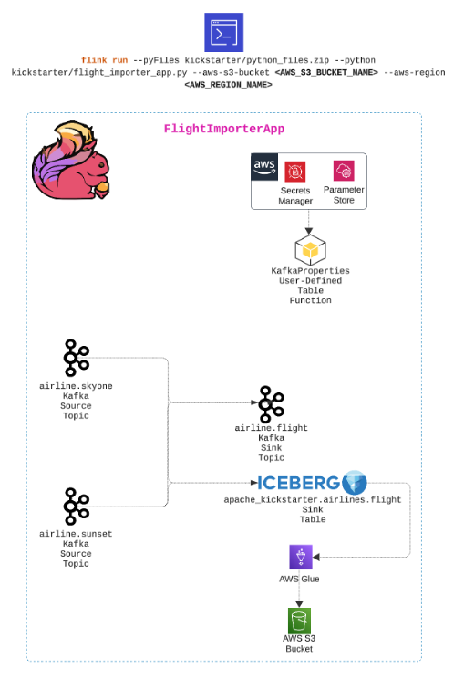
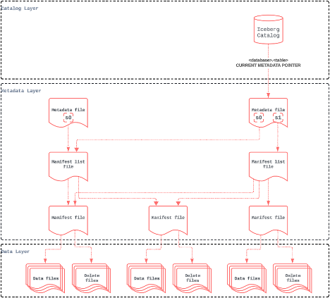
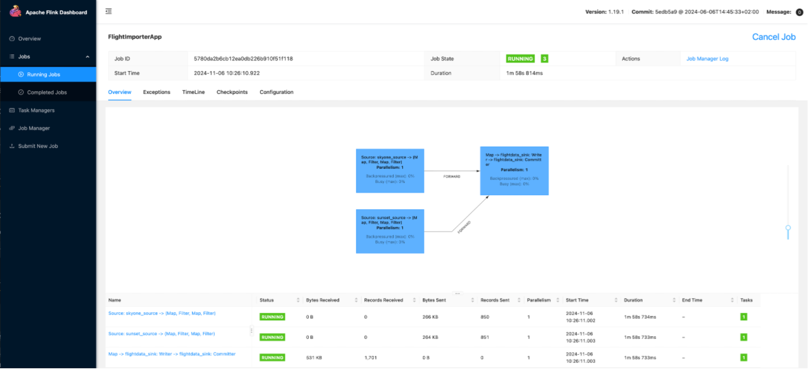

# Apache Iceberg in Action with Apache Flink using Python
Data engineering transforms raw data into useful, accessible data products in the Data Mesh platform-building era. Like the signalRoom GenAI Data Mesh platform, we package our data products in Apache Iceberg tables. In this article, I’ll take you through sinking your Apache Flink data into Apache Iceberg tables using Python.  (If you want to do this using Java, click [here](apache-iceberg-in-action-with-apache-flink-using-java.md).)

In this article, I’ll walk you through how to seamlessly sink data in your Flink application to Apache Iceberg tables using AWS Glue as your Apache Iceberg catalog, ensuring reliability, performance, and future-proof data storage. We will do this using the [Apache Flink Kickstarter Flight Importer app](https://github.com/j3-signalroom/apache_flink-kickstarter/blob/main/python/src/kickstarter/flight_importer_app.py). This app combines synthetic flight data from two fictional airlines (`Sunset Air` and `SkyOne`) and streams the combined data into Apache Kafka and Apache Iceberg. The app provides real-time and historical analytics capabilities, demonstrating the power of Apache Iceberg as a table format for large, complex analytic datasets in distributed data lakehouses. Moreover, it illustrates how AWS Glue is used as the metadata catalog for the Apache Iceberg table.



The agenda for the remainder of the article is as follows:


- What is Apache Iceberg, and why is it a game-changer for data platform architecture?
- How to set up AWS Glue to use it as your Apache Iceberg catalog.
- Step-by-step walkthrough of the Flight Importer Flink App that puts it all together.

## What is Apache Iceberg?
Apache Iceberg was created in 2017 by Netflix’s Ryan Blue and Daniel Weeks. It is an open table format designed to resolve the deficiencies of working with data lakes, especially those on distributed storage systems like Amazon S3, Google Cloud Storage, and Azure Blob Storage. A table format is a method of structuring a dataset’s files to present them as a unified “table.” From the user’s perspective, it can be defined as the answer to the question, “What data is in this table?” However, to implement a table format on a distributed storage system, Apache Iceberg needed to overcome several challenges posed by distributed storage systems (e.g., S3, Google Cloud Storage, and Azure Blob Storage):

Problem|Challenge|Impact|Solution
-|-|-|-
**Lack of Consistency and ACID Guarantees**|Distributed storage systems are typically designed for object storage, not traditional database operations. This leads to issues with consistency, especially during concurrent read and write operations.|Without ACID (Atomicity, Consistency, Isolation, Durability) guarantees, operations like updates, deletes, and inserts can become error-prone, leading to inconsistent data views across different sessions or processes.|Apache Iceberg provides ACID compliance, ensuring reliable data consistency on distributed storage systems.
**Bloated Metatdata Files and Slow Query Performance**|As datasets grow in size, so does the metadata (file paths, schema, partitions) associated with them. Efficiently querying large volumes of metadata can become slow and inefficient.|Simple operations like listing files in a directory can become time-consuming, affecting the performance of queries and applications.|Apache Iceberg organizes data into partitions and adds metadata layers, reducing the need to scan the entire dataset and optimizing query performance. This approach allows for filtering data at the metadata level, which avoids loading unnecessary files.
**Lack of Schema Evolution and Data Mutability**|Analytic datasets often require schema changes (e.g., adding or renaming columns) as business requirements evolve. Distributed storage formats typically lack built-in support for handling schema changes efficiently.|Without schema evolution support, datasets require complex data transformations or complete rewrites, which can be slow and resource-intensive.|Apache Iceberg allows schema changes without reprocessing the entire dataset, making it easy to add new fields or alter existing ones over time.
**Inefficient Partitioning and Data Skipping**|Distributed storage systems don't natively support data partitioning, which is crucial for optimizing queries on large datasets.|Lack of partitioning increases query latency because the system has to scan more data than necessary.|Apache Iceberg allows hidden partitioning and metadata-based pruning, ensuring queries only read the required partitions, reducing scan times and improving performance.
**Lack of Data Versioning and Time Travel**|Many analytic workflows need to access previous data versions for tasks like auditing, debugging, or historical analysis. Distributed storage doesn’t offer built-in support for versioning.|Maintaining multiple versions of the same dataset becomes cumbersome, especially without efficient version control, and can lead to excessive storage costs.|Apache Iceberg offer time travel, allowing users to access snapshots of data at different points in time, providing easy access to historical data.
**Unable to do Concurrent Read and Write Operations**|Large analytic workloads often involve multiple processes reading from and writing to the same data simultaneously. Distributed storage systems do not inherently support these concurrent operations smoothly.|Without proper handling, this can lead to data corruption or version conflicts, especially during high-throughput operations.|Apache Iceberg’s transactional model enables concurrent operations safely by managing snapshots and transactions, ensuring data integrity and consistency.
**Too Many Small Files**|Distributed storage systems can accumulate many small files over time due to frequent appends or updates.|Small files lead to inefficient I/O operations and high metadata costs, degrading query performance and increasing storage costs.|Apache Iceberg handles file compaction as part of data maintenance routines, merging small files into larger ones to optimize storage and access efficiency.

By addressing these challenges, the Apache Iceberg table format enables scalable, high-performance, easy-to-use, and lower-cost data lakehouse solutions (the successor to data lakes). These solutions combine the best of data warehouse and data lake design and leverage distributed storage for both analytic and streaming workloads.

With the challenges resolved by Apache Iceberg when working on a distributed storage system, the question arises: how does it manage the metadata? This is where Apache Iceberg utilizes an engine (i.e., catalog), such as **AWS Glue**, **Hive Megastore**, or **Hadoop** filesystem catalog, to track a table’s partitioning, sorting, and schema over time, and so much more using a tree of metadata that an engine can use to plan queries in a fraction of the time it would take with legacy data lake patterns.



This metadata tree breaks down the metadata of the table into four components:

- **Manifest file:** A list of data files containing each data file’s location/path and key metadata about those data files, which allows for creating more efficient execution plans.
- **Manifest list:** Files that define a single snapshot of the table as a list of manifest files and stats on those manifests that allow for creating more efficient execution plans.
- **Metadata file:** Files that define a table’s structure, including its schema, partitioning scheme, and a listing of snapshots.
- **Catalog:** This tool tracks the table location (similar to the Hive Metastore), but instead of containing a mapping of table name -> set of directories, it includes a mapping of table name -> location of the table’s most recent metadata file. Several tools, including a Hive Metastore, can be used as a catalog.

### Why Apache Iceberg is a Game-changer?
The true power of Apache Iceberg is that it allows for the separation of storage from compute. This means we are **NO LONGER LOCKED INTO** a single data vendor’s compute engine (e.g., Hive, **Flink**, Presto, **Snowflake**, **Spark**, and Trino)! We store the data independently of the compute engine in our distributed storage system (e.g., Amazon S3, Google Cloud Storage, and Azure Blob Storage). Then, we connect to the compute engine that best fits our use case for whatever situation we use our data in! Moreover, we could have one copy of the data and use different engines for different use cases. Now, let that sit with you!


> Imagine the freedom to choose the most cost-effective solution every time you process your data. Whether Apache Flink is more budget-friendly than Snowflake or vice versa, you have the power to decide! Your data isn’t locked into any specific compute engine, giving you ultimate flexibility to optimize for both performance and cost.


## AWS Glue for your Apache Iceberg Catalog
**AWS Glue** is a fully managed extract, transform, and load (ETL) service offered by Amazon Web Services (AWS). It simplifies preparing and loading data for analytics by automating data discovery, schema inference, and job scheduling. In addition, the AWS Glue Data Catalog serves as a centralized metadata repository for Apache Iceberg Tables.

The easiest way to set up AWS Glue in your environment — assuming AWS is your cloud provider — is to use Terraform. I primarily choose Terraform because it is essential for implementing CI/CD (Continuous Integration/Continuous Development) in any environment. This approach ensures that infrastructure deployment is scalable, repeatable, and manageable.

Below is a step-by-step guide with Terraform code to establish the necessary infrastructure for integrating AWS Glue and Amazon S3 with Apache Iceberg. This setup is designed to store Apache Iceberg tables in S3, manage metadata through AWS Glue, and ensure that the appropriate IAM roles and policies are in place for permissions:

### Step 1 of 5. Create the `<YOUR-UNIQUE-BUCKET-NAME>` S3 Bucket for Apache Iceberg Tables
```hcl
resource "aws_s3_bucket" "iceberg_bucket" {
  bucket = <YOUR-UNIQUE-BUCKET-NAME>
}
```

### Step 2 of 5. Create the `warehouse/` Folder Object within the S3 Bucket
```hcl
resource "aws_s3_object" "warehouse" {
  bucket = aws_s3_bucket.iceberg_bucket.bucket
  key    = "warehouse/"
}
```

### Step 3 of 5. IAM Role for AWS Glue
```hcl
resource "aws_iam_role" "glue_role" {
  name = "glue_service_role"
  assume_role_policy = jsonencode({
    "Version": "2012-10-17",
    "Statement": [
      {
        "Effect": "Allow",
        "Principal": {
          "Service": "glue.amazonaws.com"
        },
        "Action": "sts:AssumeRole"
      }
    ]
  })
}
```

### Step 4 of 5. IAM Policy for S3 Access
```hcl
resource "aws_iam_policy" "glue_s3_access_policy" {
  name = "GlueS3AccessPolicy"  policy = jsonencode({
    "Version": "2012-10-17",
    "Statement": [
      {
        "Effect": "Allow",
        "Action": [
          "s3:GetObject",
          "s3:PutObject",
          "s3:ListBucket"
        ],
        "Resource": [
          aws_s3_bucket.iceberg_bucket.arn,
          "${aws_s3_bucket.iceberg_bucket.arn}/*"
        ]
      }
    ]
  })
}
```

### Step 5 of 5. Attach IAM Policy to the AWS Glue Role
```hcl
resource "aws_iam_role_policy_attachment" "glue_policy_attachment" {
  role       = aws_iam_role.glue_role.name
  policy_arn = aws_iam_policy.glue_s3_access_policy.arn
}
```

This Terraform code is essential for setting up an **AWS S3 Bucket**, **AWS Glue**, and **Apache Iceberg** infrastructure. It is designed for managing metadata, storing data files in S3, and granting permissions for AWS Glue to handle the lifecycle of Apache Iceberg Tables. This setup is ideal for implementing data lakehouse solutions that require efficient metadata management and seamless integration with AWS services.

## Step-by-Step Walkthrough of the Flight Importer Flink App
The [`flight_importer_app`](https://github.com/j3-signalroom/apache_flink-kickstarter/blob/main/python/src/kickstarter/flight_importer_app.py) showcases the power of Apache Flink in building a cutting-edge streaming analytics pipeline. This dynamic application ingests airline flight data from two Kafka topics, seamlessly merging the streams into a unified Kafka topic and an Apache Iceberg table. The result? Real-time analytics with historical depth give you unparalleled insights at every moment. With Flink's DataStream API and Iceberg's seamless integration via AWS Glue, this app exemplifies how to harness the full potential of modern data processing for high-impact analytics. Below, you'll find a step-by-step breakdown of how it all works:

### Step 1 of 14. The required JARs for the Flink app
```bash
curl -L "https://repo1.maven.org/maven2/org/apache/flink/flink-s3-fs-hadoop/1.20.0/flink-s3-fs-hadoop-1.20.0.jar" -o "/opt/flink/lib/flink-s3-fs-hadoop-1.20.0.jar"
curl -L "https://repo1.maven.org/maven2/org/apache/hadoop/hadoop-common/3.4.1/hadoop-common-3.4.1.jar" -o "/opt/flink/lib/hadoop-common-3.4.1.jar"
curl -L "https://repo1.maven.org/maven2/org/apache/flink/flink-shaded-hadoop-2-uber/2.8.3-10.0/flink-shaded-hadoop-2-uber-2.8.3-10.0.jar" -o "/opt/flink/lib/flink-shaded-hadoop-2-uber-2.8.3-10.0.jar"
curl -L "https://repo1.maven.org/maven2/org/apache/iceberg/iceberg-flink-runtime-1.20/1.7.0/iceberg-flink-runtime-1.20-1.7.0.jar" -o "/opt/flink/lib/iceberg-flink-runtime-1.20-1.7.0.jar"
curl -L "https://repo1.maven.org/maven2/org/apache/iceberg/iceberg-aws-bundle/1.7.0/iceberg-aws-bundle-1.7.0.jar" -o "/opt/flink/lib/iceberg-aws-bundle-1.7.0.jar"
curl -L "https://repo1.maven.org/maven2/org/apache/hadoop/hadoop-hdfs-client/3.4.1/hadoop-hdfs-client-3.4.1.jar" -o "/opt/flink/lib/hadoop-hdfs-client-3.4.1.jar"
curl -L "https://repo1.maven.org/maven2/org/apache/flink/flink-sql-connector-kafka/3.3.0-1.20/flink-sql-connector-kafka-3.3.0-1.20.jar" -o "/opt/flink/lib/flink-sql-connector-kafka-3.3.0-1.20.jar"
curl -L "https://repo1.maven.org/maven2/org/apache/flink/flink-connector-kafka/3.3.0-1.20/flink-connector-kafka-3.3.0-1.20.jar" -o "/opt/flink/lib/flink-connector-kafka-3.3.0-1.20.jar"
curl -L "https://repo1.maven.org/maven2/org/apache/flink/flink-json/1.20.0/flink-json-1.20.0.jar" -o "/opt/flink/lib/flink-json-1.20.0.jar"
curl -L "https://repo1.maven.org/maven2/org/apache/kafka/kafka-clients/3.8.0/kafka-clients-3.8.0.jar" -o "/opt/flink/lib/kafka-clients-3.8.0.jar"
```

- The code example above is the list of JARs I used to run the Flink app successfully. These JARs include the Flink S3 connector, Flink Hive connector, Hadoop, Iceberg, Kafka, and JSON connectors. These dependencies are essential for integrating Flink with Apache Iceberg, Kafka, and other services required for the streaming analytics pipeline.

```yaml
[project]
name = "kickstarter"
version = "0.52.00.000"
description = "Apache Flink Kickstarter"
readme = "README.md"
requires-python = "~=3.11.9"
dependencies = [
    "apache-flink==1.20.0",
    "boto3>=1.35.36",
    "botocore>=1.35.36",
    "confluent-kafka==2.5.3",
    "grpcio-tools>=1.29.0,<=1.50.0",
    "plotly>=5.24.1",
    "py4j==0.10.9.7",
    "pyflink>=1.0",
    "pyiceberg[glue,s3fs]>=0.7.1",
    "setuptools>=37.0.0",
    "streamlit-aggrid>=1.0.5",
    "streamlit>=1.39.0",
]
```

- The code example above is the content of the `pyproject.toml`.  This configuration file is used in the Python project to build the required dependencies I used for the Flink app to run successfully. These dependencies include Apache Flink, Boto3, Confluent Kafka, Plotly, PyFlink, PyIceberg, Setuptools, Streamlit, and Streamlit AgGrid. These dependencies are essential for building and integrating the Flink app with Apache Iceberg, Kafka, and other services required for the streaming analytics pipeline.

> `pyproject.toml` is a configuration file used in Python projects to specify build system requirements and project metadata. It serves as a way to standardize and simplify the Python build process, especially when using modern build tools such as [uv](https://docs.astral.sh/uv/), [Poetry](https://python-poetry.org/), or [Setuptools](https://setuptools.pypa.io/en/latest/). This file is defined by [PEP 518](https://peps.python.org/pep-0518/) and is supported by most modern Python package managers.

### Step 2 of 14.  Import the required Python libraries
```python
from pyflink.common import WatermarkStrategy
from pyflink.datastream import StreamExecutionEnvironment, DataStream
from pyflink.datastream.connectors.kafka import KafkaSource, KafkaSink, KafkaRecordSerializationSchema, KafkaOffsetsInitializer, DeliveryGuarantee
from pyflink.datastream.formats.json import JsonRowDeserializationSchema, JsonRowSerializationSchema
from pyflink.table import StreamTableEnvironment
from pyflink.table.catalog import ObjectPath
from datetime import datetime, timezone
import argparse

from model.flight_data import FlightData
from model.airline_flight_data import AirlineFlightData
from helper.kafka_properties_udtf import execute_confluent_properties_udtf
from helper.utilities import parse_isoformat, load_catalog, load_database
```

- Since [`FlightData`](https://github.com/j3-signalroom/apache_flink-kickstarter/blob/main/python/src/kickstarter/model/flight_data.py) and [`AirlineFlightData`](https://github.com/j3-signalroom/apache_flink-kickstarter/blob/main/python/src/kickstarter/model/airline_flight_data.py) are custom classes, they must be imported into the Flink application. These classes define the flight and airline data schema, specifying the attributes and their types. The Kafka properties User-Defined Table Function (UDTF) and utility functions are also imported to manage Kafka properties and other helper functionalities efficiently. For more details on the Kafka properties, you can [click here](link_to_kafka_prhttps://thej3.com/how-to-create-a-user-defined-table-function-udtf-in-pyflink-to-fetch-data-from-an-external-source-799a93c90d2coperties_info), and to explore the helper utility methods, [click here](https://github.com/j3-signalroom/apache_flink-kickstarter/blob/main/python/src/kickstarter/helper/utilities.py).

```python
def main(args):
    """The entry point to the Flight Importer Flink App (a.k.a., Flink job graph --- DAG).
        
    Args:
        args (str): is the arguments passed to the script.
    """
    ...


if __name__ == "__main__":
    parser = argparse.ArgumentParser()
    parser.add_argument('--aws-s3-bucket',
                        dest='s3_bucket_name',
                        required=True,
                        help='The AWS S3 bucket name.')
    parser.add_argument('--aws-region',
                        dest='aws_region',
                        required=True,
                        help='The AWS Rgion name.')
    known_args, _ = parser.parse_known_args()
    main(known_args)
```
- Place the code in _**steps 3 through 14**_ in the `main()` method.

### Step 3 of 14. Set up the Flink environment
```python
    # --- Create a blank Flink execution environment
    env = StreamExecutionEnvironment.get_execution_environment()

    # --- Enable checkpointing every 5000 milliseconds (5 seconds)
    env.enable_checkpointing(5000)

    #
    # Set timeout to 60 seconds
    # The maximum amount of time a checkpoint attempt can take before being discarded.
    #
    env.get_checkpoint_config().set_checkpoint_timeout(60000)

    #
    # Set the maximum number of concurrent checkpoints to 1 (i.e., only one checkpoint
    # is created at a time)
    #
    env.get_checkpoint_config().set_max_concurrent_checkpoints(1)

    # Create a Table Environment
    tbl_env = StreamTableEnvironment.create(stream_execution_environment=env)
```

- **Stream Execution Environment:** Creates the Flink `StreamExecutionEnvironment`, which represents the Flink job's DAG (Directed Acyclic Graph) and enables typical Apache Flink checkpointing settings.

> _[Apache Flink Checkpointing](https://nightlies.apache.org/flink/flink-docs-master/docs/dev/datastream/fault-tolerance/checkpointing/#:~:text=Checkpoints%20allow%20Flink%20to%20recover,Flink's%20streaming%20fault%20tolerance%20mechanism.) is a fault-tolerance mechanism that enables stateful stream processing applications to recover from failures while maintaining exactly-once processing semantics._

- **Table Environment:** Creates a `StreamTableEnvironment` to work with Flink's Table API allows for SQL-like operations and integration with other data processing systems.

### Step 4 of 14.  Get Kafka Consumer Client Kafka Cluster properties
```python
    # Get Kafka Consumer Client Kafka Cluster properties
    consumer_properties = execute_confluent_properties_udtf(tbl_env, True, args.s3_bucket_name)
```
- The function `execute_confluent_properties_udtf()` is designed to retrieve Kafka cluster properties by triggering the ConfluentProperties User-Defined Table Function (UDTF).

### Step 5 of 14.  Consumer the `airline.skyone` and `airline.sunset` Kafka topics
```python
# Sets up a Flink Kafka source to consume data from the Kafka topic `airline.skyone`
# Note: KafkaSource was introduced in Flink 1.14.0.  If you are using an older version of Flink, 
# you will need to use the FlinkKafkaConsumer class.
skyone_source = (KafkaSource.builder()
                            .set_properties(consumer_properties)
                            .set_topics("airline.skyone")
                            .set_group_id("skyone_group")
                            .set_starting_offsets(KafkaOffsetsInitializer.earliest())
                            .set_value_only_deserializer(JsonRowDeserializationSchema
                                                            .builder()
                                                            .type_info(AirlineFlightData.get_value_type_info())
                                                            .build())
                            .build())

# Takes the results of the Kafka source and attaches the unbounded data stream
skyone_stream = (env.from_source(skyone_source, WatermarkStrategy.no_watermarks(), "skyone_source")
                    .uid("skyone_source"))

# Sets up a Flink Kafka source to consume data from the Kafka topic `airline.sunset`
sunset_source = (KafkaSource.builder()
                            .set_properties(consumer_properties)
                            .set_topics("airline.sunset")
                            .set_group_id("sunset_group")
                            .set_starting_offsets(KafkaOffsetsInitializer.earliest())
                            .set_value_only_deserializer(JsonRowDeserializationSchema
                                                            .builder()
                                                            .type_info(AirlineFlightData.get_value_type_info())
                                                            .build())
                            .build())

# Takes the results of the Kafka source and attaches the unbounded data stream
sunset_stream = (env.from_source(sunset_source, WatermarkStrategy.no_watermarks(), "sunset_source")
                    .uid("sunset_source"))
```

### Step 6 of 14.  Get Kafka Producer Client Kafka Cluster properties
```python
# Sets up a Flink Kafka sink to produce data to the Kafka topic `airline.flight`
# Get the Kafka Cluster properties for the producer
producer_properties = execute_confluent_properties_udtf(tbl_env, False, args.s3_bucket_name)
producer_properties.update({
    'transaction.timeout.ms': '60000'  # Set transaction timeout to 60 seconds
})
```

### Step 7 of 14.  Create Kafka Sink
```python
# Note: KafkaSink was introduced in Flink 1.14.0.  If you are using an older version of Flink, 
# you will need to use the FlinkKafkaProducer class.
# Initialize the KafkaSink builder
kafka_sink_builder = KafkaSink.builder().set_bootstrap_servers(producer_properties['bootstrap.servers'])

# Loop through the producer properties and set each property
for key, value in producer_properties.items():
    if key != 'bootstrap.servers':  # Skip the bootstrap.servers as it is already set
        kafka_sink_builder.set_property(key, value)

# Sets up a Flink Kafka sink to produce data to the Kafka topic `airline.flyer_stats`
flight_sink = (kafka_sink_builder                            
                .set_record_serializer(KafkaRecordSerializationSchema
                                        .builder()
                                        .set_topic("airline.flight")
                                        .set_value_serialization_schema(JsonRowSerializationSchema
                                                                        .builder()
                                                                        .with_type_info(FlightData.get_value_type_info())
                                                                        .build())
                                        .build())
                .set_delivery_guarantee(DeliveryGuarantee.EXACTLY_ONCE)
                .build())
```

### Step 8 of 14.  Configure, Register, and Set the Apache Iceberg Catalog
```python
# --- Load Apache Iceberg catalog
catalog = load_catalog(tbl_env, args.aws_region, args.s3_bucket_name.replace("_", "-"), "apache_kickstarter")

# --- Print the current catalog name
print(f"Current catalog: {tbl_env.get_current_catalog()}")
```

- The `helper.utilities.load_catalog()` function configures, registers, and sets the Apache Iceberg catalog in the Flink environment. This function is essential for managing metadata and storing data in Apache Iceberg tables.

```python
def load_catalog(tbl_env: StreamExecutionEnvironment, region_name: str, bucket_name: str, catalog_name: str) -> Catalog:
    """ This method loads the catalog into the environment.
    
    Args:
        tbl_env (StreamExecutionEnvironment): The StreamExecutionEnvironment is the context
        in which a streaming program is executed. 
        region_name (str): The region where the bucket is located.
        bucket_name (str): The name of the bucket where the warehouse is located.
        catalog_name (str): The name of the catalog to be loaded into the environment.
        
    Returns:
        Catalog: The catalog object is returned if the catalog is loaded into the environment.
    """
    try:
        if not catalog_exist(tbl_env, catalog_name):
            tbl_env.execute_sql(f"""
                CREATE CATALOG {catalog_name} WITH (
                    'type' = 'iceberg',
                    'warehouse' = 's3://{bucket_name}/warehouse',
                    'catalog-impl' = 'org.apache.iceberg.aws.glue.GlueCatalog',
                    'io-impl' = 'org.apache.iceberg.aws.s3.S3FileIO',
                    'glue.skip-archive' = 'True',
                    'glue.region' = '{region_name}'
                    );
            """)
        else:
            print(f"The {catalog_name} catalog already exists.")
    except Exception as e:
        print(f"A critical error occurred to during the processing of the catalog because {e}")
        exit(1)

    # --- Use the Iceberg catalog
    tbl_env.use_catalog(catalog_name)

    # --- Access the Iceberg catalog to query the airlines database
    return tbl_env.get_catalog(catalog_name)


def catalog_exist(tbl_env: StreamExecutionEnvironment, catalog_to_check: str) -> bool:
    """This method checks if the catalog exist in the environment.

    Args:
        tbl_env (StreamExecutionEnvironment): The StreamExecutionEnvironment is the context
        in which a streaming program is executed. 
        catalog_to_check (str): The name of the catalog to be checked if its name exist in the
        environment.

    Returns:
        bool: True is returned, if the catalog exist in the environment.  Otherwise, False is
        returned.
    """
    catalogs = tbl_env.list_catalogs()

    # Check if a specific catalog exists
    if catalog_to_check in catalogs:
        return True
    else:
        return False
```

### Step 9 of 14.  Check if the Apache Flink Catalog Database Exists and Create It if it Does Not
> _What is an Apache Flink Catalog Database?_
> 
> _The Apache Flink catalog database is a logical namespace that stores metadata about data sources, including databases, tables, and views. The catalog provides a unified API for managing metadata accessible from the Table API and SQL Queries._

```python
# --- Load database
load_database(tbl_env, catalog, "airlines")

# Print the current database name
print(f"Current database: {tbl_env.get_current_database()}")
```

-  Call the `helper.utilities.load_database()` function to load the `airlines` database into the Flink environment.

```python
def load_database(tbl_env: StreamExecutionEnvironment, catalog: Catalog, database_name:str) -> None:
    """This method loads the database into the environment.

    Args:
        tbl_env (StreamExecutionEnvironment): The StreamExecutionEnvironment is the con.text
        catalog (Catalog): The catalog object is the catalog to be used to create the database.
        database_name (str): The name of the database to be loaded into the environment.
    """
    try:
        if not catalog.database_exists(database_name):
            tbl_env.execute_sql(f"CREATE DATABASE IF NOT EXISTS {database_name};")
        else:
            print(f"The {database_name} database already exists.")
        tbl_env.use_database(database_name)
    except Exception as e:
        print(f"A critical error occurred to during the processing of the database because {e}")
        exit(1)
```

### Step 10 of 14.  Create the `airlines.flight` Apache Iceberg Table
```python
# An ObjectPath in Apache Flink is a class that represents the fully qualified path to a
# catalog object, such as a table, view, or function.  It uniquely identifies an object
# within a catalog by encapsulating both the database name and the object name.  For 
# instance, this case we using it to get the fully qualified path of the `flight`
# table
flight_table_path = ObjectPath(tbl_env.get_current_database(), "flight")

# Check if the table exists.  If not, create it
try:
    if not catalog.table_exists(flight_table_path):
        # Define the table using Flink SQL
        tbl_env.execute_sql(f"""
            CREATE TABLE {flight_table_path.get_full_name()} (
                email_address STRING,
                departure_time STRING,
                departure_airport_code STRING,
                arrival_time STRING,
                arrival_airport_code STRING,
                flight_number STRING,
                confirmation STRING,
                airline STRING
            ) WITH (
                'write.format.default' = 'parquet',
                'write.target-file-size-bytes' = '134217728',
                'partitioning' = 'arrival_airport_code',
                'format-version' = '2'
            )
        """)
except Exception as e:
    print(f"A critical error occurred to during the processing of the table because {e}")
    exit(1)
```

### Step 11 of 14.  Combine the `skyone` and `sunset` Airline DataStreams into one DataStream
```python
# Combine the Airline DataStreams into one DataStream
flight_datastream = combine_datastreams(skyone_stream, sunset_stream).map(lambda d: d.to_row(), output_type=FlightData.get_value_type_info())
```

- The `combine_datastreams()` function is used to merge the `skyone` and `sunset` airline DataStreams into a single DataStream. This function is essential for combining the two streams and mapping the data to the `FlightData` schema.

```python
def combine_datastreams(skyone_stream: DataStream, sunset_stream: DataStream) -> DataStream:
    """This method defines the workflow for the Flink job graph (DAG) by connecting the data streams.

    Args:
        skyone_stream (DataStream): is the source of the SkyOne Airlines flight data.
        sunset_stream (DataStream): is the source of the Sunset Air flight data.

    Returns:
        DataStream: the union of the SkyOne Airlines and Sunset Air flight data streams.
    """
    # Map the data streams to the FlightData model and filter out Skyone flights that have already arrived
    skyone_flight_stream = (skyone_stream
                            .map(lambda flight: AirlineFlightData.to_flight_data("SkyOne", flight))
                            .filter(lambda flight: parse_isoformat(flight.arrival_time) > datetime.now(timezone.utc)))

    # Map the data streams to the FlightData model and filter out Sunset flights that have already arrived
    sunset_flight_stream = (sunset_stream
                            .map(lambda flight: AirlineFlightData.to_flight_data("Sunset", flight))
                            .filter(lambda flight: parse_isoformat(flight.arrival_time) > datetime.now(timezone.utc)))
    
    # Return the union of the two data streams
    return skyone_flight_stream.union(sunset_flight_stream)


def parse_isoformat(date_string: str) -> datetime:
    """This method parses a string representing a date and time in ISO 8601 format.

    Args:
        date_string (str): The string representing a date and time in ISO 8601 format.

    Returns:
        datetime: The datetime object representing the date and time in ISO 8601 format.
    """
    try:
        date_time_obj = datetime.strptime(date_string, "%Y-%m-%d %H:%M:%S")
        date_time_utc = date_time_obj.replace(tzinfo=timezone.utc).astimezone(timezone.utc)
        return date_time_utc
    except ValueError:
        print(f"Invalid isoformat string: '{date_string}'")
        return None
```

### Step 12 of 14.  Sink the `flight_datastream` into the `airlines.flight` Apache Iceberg Table
```python
# Populate the Apache Iceberg Table with the data from the data stream
(tbl_env.from_data_stream(flight_datastream)
        .execute_insert(flight_table_path.get_full_name()))
```        
> _**Upserts in PyFlink:** `PyFlink` itself does not directly expose methods like `.upsert(true)` or `equalityFieldColumns` as in Java's FlinkSink API.  Upserts can be simulated using primary keys or handling data deduplication within your source transformation logic (i.e., using the Table API `execute_insert()` method)._

### Step 13 of 14.  Sink the `flight_datastream` into the `airline.flight` Kafka Topic
```python
# Sinks the Flight DataStream into a single Kafka topic
(flight_datastream.sink_to(flight_sink)
                    .name("flightdata_sink")
                    .uid("flightdata_sink"))
```

### Step 14 of 14.  Execute the Flink Job Graph (a.k.a., DAG)
```python
# Execute the Flink job graph (DAG)
try: 
    env.execute("FlightImporterApp")
except Exception as e:
    print(f"The App stopped early due to the following: {e}.")
```
- Triggers the Flink Application execution.

## Give it a spin!
Now that you have a solid understanding of the Flight Importer Flink App, it's time to put it to the test! Run the Flink app in your environment and observe as it ingests airline flight data from Kafka topics, merges the streams, and populates an Apache Iceberg table and Kafka topic with real-time analytics. This advanced streaming analytics pipeline demonstrates the capabilities of Apache Flink and Apache Iceberg, providing valuable insights at every moment. So, what are you waiting for? Give it a try and witness the magic unfold!

Run the following command in your Flink cluster environment from the terminal command line, as shown in the example below:
```bash
uv run flink run --pyFiles kickstarter/python_files.zip --python kickstarter/flight_importer_app.py --aws-s3-bucket <AWS_S3_BUCKET> --aws-region <AWS_REGION_NAME>
```

If you don’t have your own Flink cluster environment, you can run it from Docker. I have created one specific to this project [here](https://github.com/j3-signalroom/apache_flink-kickstarter/blob/main/README.md) that you can use.

To check the status of the running app, visit the Apache Flink Dashboard as shown below:




### Special Mention
Before we move on, take a moment to notice something new right before the `flink run` command—the `uv` run comes right before it! What is `uv`, you ask? Well, it's an incredibly fast Python package installer and dependency resolver, written in Rust, and designed to seamlessly replace `pip` and pip-tools in your workflows. By prefixing uv run to a command, you're ensuring that the command runs in an optimal Python environment.

Now, let's break down the magic behind uv run:
- When you use it with a file ending in `.py` or an HTTP(S) URL, uv treats it as a script and runs it with a Python interpreter. In other words, `uv run` `file.py` is equivalent to `uv` run python file.py. If you're working with a URL, `uv` even downloads it temporarily to execute it. Any inline dependency metadata is installed into an isolated, temporary environment—meaning zero leftover mess! When used with `-`, the input will be read from `stdin`, and treated as a Python script.
- If used in a project directory, uv will automatically create or update the project environment before running the command.
- Outside of a project, if there's a virtual environment present in your current directory (or any parent directory), uv runs the command in that environment. If no environment is found, it uses the interpreter's environment.

So what does this mean when we put `uv` run before `flink run`? It means uv takes care of all the setup—fast and seamless—right on the Flink cluster. If you think AI/ML is magic, the work the folks at Astral have done with uv is pure wizardry!

Curious to learn more about Astral's `uv`? Check these out:
- Documentation: Learn about [uv](https://docs.astral.sh/uv/).
- Video: [uv IS the Future of Python Packing!](https://www.youtube.com/watch?v=8UuW8o4bHbw).

## Summary
The flight_importer_app is a well-rounded Flink application that demonstrates the following:

- **Integration with Kafka and Iceberg:** Consuming and Publishing data to/from Kafka for real-time analytics and to Iceberg for historical analysis.
- **AWS Glue for Metadata Management:** Integrating AWS Glue with Iceberg to manage metadata in a centralized, consistent manner.
- **Resiliency and Fault Tolerance:** Implementing checkpointing and delivery guarantees to ensure the stability and reliability of the data pipeline.

This code example embodies the principles of modern data architectures, such as data lakehouses, by seamlessly integrating the strengths of data lakes and data warehouses. It empowers real-time data processing, efficient storage, and in-depth historical analysis — all while offering unmatched flexibility, scalability, and cost-efficiency.

## Resources
- Jeffrey Jonathan Jennings.  [Apache Iceberg in Action with Apache Flink using Java](https://thej3.com/apache-iceberg-in-action-with-apache-flink-using-java-158500688ead).  Medium, 2024.
- Tomer Shiran, Jason Hughes & Alex Merced.  [Apache Iceberg — The Definitive Guide](https://www.dremio.com/wp-content/uploads/2023/02/apache-iceberg-TDG_ER1.pdf).  O’Reilly, 2024.
- Jeffrey Jonathan Jennings. [Apache Flink Kickstarter](https://github.com/j3-signalroom/apache_flink-kickstarter/tree/main).  GitHub, 2024.
- Apache Iceberg Community.  [Apache Iceberg v1.7.0 Documentation](https://iceberg.apache.org/docs/1.7.0/). The Apache Software Foundation, 2024.
