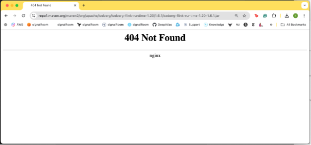

# Apache Flink + Apache Iceberg + AWS Glue: Get Your JAR Versions Right!
If you're like me and want to work with the latest versions of Apache Flink, Apache Iceberg, and AWS Glue as your metastore, I've got some key insights to share. Before diving in, I want to acknowledge [Zhe Wang’s post, Catalog Iceberg Data with AWS Glue Catalog from Flink Job](https://medium.com/@zh3w4ng/catalog-iceberg-data-with-aws-glue-catalog-from-flink-job-aecffdc7bdd1), and [Matt Slalom’s response on GitHub for Apache Iceberg Issue #3044](https://github.com/apache/iceberg/issues/3044#issuecomment-1273900117) for pointing me in the right direction.


Before a single line of code can run, with Java-based tools like Flink and Iceberg, you need the right JARs in your build—and they must be compatible with each other. Let me tell you, that’s quite an undertaking! It takes a lot of time, especially with the trial and error involved in integrating multiple technologies. Seriously, if anyone has the secret list of which JARs go with which versions, please share! I'm getting old, and I’d love to make up for lost time. 😉


But hey, I cracked the code for getting my [Apache Flink Kickstarter public project](https://github.com/j3-signalroom/apache_flink-kickstarter) off the ground.


## Take a look

For those who are old too, or just want me to cut to the chase—here's my entire Gradle build script:

```kotlin
plugins {
    application
    id("org.kordamp.gradle.project-enforcer") version "0.14.0"
}

// --- Read the Gradle properties file
val appVersion: String? by project
val appMainClass: String? by project

repositories {
    mavenLocal()
    mavenCentral()
    maven {
        url = uri("https://packages.confluent.io/maven/")
    }
}

// --- Dependency version numbers
val flinkVersion: String = "1.19"
val flinkVersionWithPatch: String = flinkVersion + ".1"
val hadoopVersion: String = "3.3.6"
val kafkaVersion: String = "3.7.0"
val junitVersion: String = "5.10.0"
val awssdkVersion: String = "2.26.29"
var icebergVersion: String = "1.6.1"

dependencies {
    implementation("org.apache.hadoop:hadoop-common:${hadoopVersion}")
    implementation("org.apache.kafka:kafka-clients:${kafkaVersion}")
    implementation("org.apache.flink:flink-java:${flinkVersionWithPatch}")
    compileOnly("org.apache.flink:flink-streaming-java:${flinkVersionWithPatch}")
    compileOnly("org.apache.flink:flink-table-common:${flinkVersionWithPatch}")
    compileOnly("org.apache.flink:flink-table:${flinkVersionWithPatch}")
    compileOnly("org.apache.flink:flink-table-api-java-bridge:${flinkVersionWithPatch}")
    implementation("org.apache.flink:flink-clients:${flinkVersionWithPatch}")
    implementation("org.apache.flink:flink-connector-base:${flinkVersionWithPatch}")
    implementation("org.apache.flink:flink-connector-kafka:3.2.0-${flinkVersion}")
    implementation("org.apache.flink:flink-connector-datagen:${flinkVersionWithPatch}")
    implementation("org.apache.flink:flink-json:${flinkVersionWithPatch}")
    implementation("org.slf4j:slf4j-log4j12:2.0.7")
    implementation("software.amazon.awssdk:sdk-core:${awssdkVersion}")
    implementation("software.amazon.awssdk:secretsmanager:${awssdkVersion}")
    implementation("software.amazon.awssdk:ssm:${awssdkVersion}")
    implementation("software.amazon.awssdk:glue:${awssdkVersion}")
    implementation("software.amazon.awssdk:kms:${awssdkVersion}")
    implementation("software.amazon.awssdk:s3:${awssdkVersion}")
    implementation("software.amazon.awssdk:sts:${awssdkVersion}")
    implementation("software.amazon.awssdk:dynamodb:${awssdkVersion}")
    implementation("org.json:json:20240303")
    runtimeOnly("org.apache.iceberg:iceberg-core:${icebergVersion}")
    runtimeOnly("org.apache.iceberg:iceberg-aws:${icebergVersion}")
    implementation("org.apache.iceberg:iceberg-snowflake:${icebergVersion}")
    implementation("org.apache.iceberg:iceberg-flink-runtime-${flinkVersion}:$icebergVersion") {
        exclude(group = "io.dropwizard.metrics", module = "metrics-core")
    }
    implementation("net.snowflake:snowflake-jdbc:3.19.0")
    
    testImplementation("org.apache.flink:flink-test-utils:${flinkVersionWithPatch}")
    testImplementation("org.junit.jupiter:junit-jupiter:${junitVersion}")
    testImplementation("org.junit.jupiter:junit-jupiter-api:${junitVersion}")
    testImplementation("org.junit.jupiter:junit-jupiter-engine:${junitVersion}")
    testImplementation("org.apache.flink:flink-test-utils-junit:${flinkVersionWithPatch}")
}

// --- If the version is not provided, use the default
version = appVersion ?: "x.xx.xx.xxx"

description = rootProject.name

java {
    sourceCompatibility = JavaVersion.VERSION_11
}

application {
    // --- If the main class is not provided, use the default
    if (appMainClass.isNullOrEmpty()) {
        mainClass.set("kickstarter.DataGeneratorApp")
    } else {
        mainClass.set("kickstarter." + appMainClass)
    }    
}

tasks.withType<Zip> {
    isZip64 = true
}

tasks {
    val fatJar = register<Jar>("fatJar") {
        dependsOn.addAll(listOf("compileJava", "processResources"))
        archiveBaseName.set(rootProject.name)
        duplicatesStrategy = DuplicatesStrategy.EXCLUDE
        manifest {
            attributes["Main-Class"] = application.mainClass
            attributes["Implementation-Title"] = rootProject.name
            attributes["Implementation-Version"] = project.version
        }
        from(configurations.runtimeClasspath.get().map { if (it.isDirectory) it else zipTree(it) } + sourceSets.main.get().output)
    }
    build {
        dependsOn(fatJar)
    }
}

tasks.compileJava {
    options.isIncremental = false
}

tasks.named<Test>("test") {
    useJUnitPlatform() 
    jvmArgs = listOf(
        "--add-opens", "java.base/java.util=ALL-UNNAMED",
        "--add-opens", "java.base/java.time=ALL-UNNAMED",
        "--add-opens", "java.base/java.lang.invoke=ALL-UNNAMED"
    )
}
```

 Then make sure these JARs are installed in your Apache Flink's installation `<FLINK_HOME>/lib/` folder:

 > Replace `<FLINK_HOME>` with your Apache Flink installation home directory, e.g., `/opt/flink`.

 ```bash
curl -L "https://repo1.maven.org/maven2/org/apache/flink/flink-s3-fs-hadoop/1.19.1/flink-s3-fs-hadoop-1.19.1.jar" -o "<FLINK_HOME>/lib/flink-s3-fs-hadoop-1.19.1.jar"
curl -L "https://repo1.maven.org/maven2/org/apache/flink/flink-sql-connector-hive-3.1.3_2.12/1.19.1/flink-sql-connector-hive-3.1.3_2.12-1.19.1.jar" -o "<FLINK_HOME>/lib/flink-sql-connector-hive-3.1.3_2.12-1.19.1.jar"
curl -L "https://repo1.maven.org/maven2/org/apache/hadoop/hadoop-common/3.4.0/hadoop-common-3.4.0.jar" -o "<FLINK_HOME>/lib/hadoop-common-3.4.0.jar"
curl -L "https://repo1.maven.org/maven2/org/apache/flink/flink-shaded-hadoop-2-uber/2.8.3-10.0/flink-shaded-hadoop-2-uber-2.8.3-10.0.jar" -o "<FLINK_HOME>/lib/flink-shaded-hadoop-2-uber-2.8.3-10.0.jar"
```

My goal was to run Flink apps using the latest compatible versions of Apache Flink and Apache Iceberg, with AWS Glue serving as the Iceberg metastore. To achieve this, I need the latest version of AWS Glue that seamlessly integrates with both Flink and Iceberg, ensuring maximum compatibility and performance. I accomplished this using the Gradle script along with installing the necessary JARs in the Flink home library directory!

> Now their might be some of you who say wait one minute, it's `October 20, 2024`,  `Apache Flink 1.20` has been released, so what gives?  Well it turns out that when I went to the Apache Iceberg Releases page, when down the list and click on the [1.6.1 Flink 1.20 runtime Jar](https://repo1.maven.org/maven2/org/apache/iceberg/iceberg-flink-runtime-1.20/1.6.1/iceberg-flink-runtime-1.20-1.6.1.jar) and I get this:
> 
> 
>
> So, it is missing, and therefore, I made the call to use the prior release of `Apache Flink 1.19.1`.

## I'll stop here for now
It took some effort to figure out the right combination of JARs and dependencies, so I'll let this sit for a bit—especially for those of you needing the specific JAR setup. In Part II, I'll show you how, with these JARs in place, you can build some powerful Flink apps using Java.

But for those who can't wait—I've got some hands-on code for you!  Click [here](https://github.com/j3-signalroom/apache_flink-kickstarter/tree/main/java).  I'll explain how everything works in Part II. Stay tuned!"