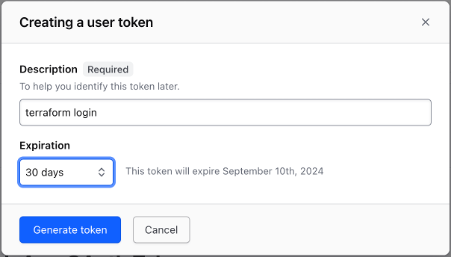
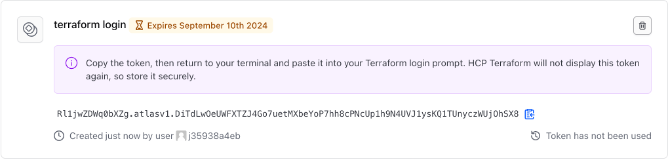
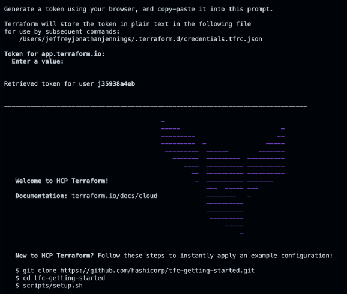

# Set up Terraform Cloud for local use

## Get Terraform Cloud API token
In order to authenticate with HCP Terraform, run the `terraform login` CLI command.  Enter `yes` to the prompt to confirm that you want to authenticate.


**Generate token**
A browser window will automatically open to the HCP Terraform login screen.  Enter a token name in the web UI, or leave the default name, `terraform login`:



Click Create API token to generate the authentication token:



Save a copy of the token in a secure location.  It provides access to your HCP Terraform organization.  Terraform will also store your token locally at the file path specified in the command output (see the picture above).

**Add the token to the CLI prompt**
When the Terraform CLI prompts you, paste the user token exactly once into your terminal.  Terraform will hide the token for security when you paste it into your terminal.  Press `Enter` to complete the authentication process:



### Set up your Confluent Cloud environment
Then in the [main.tf](main.tf) replace **`<TERRAFORM CLOUD ORGANIZATION NAME>`** in the `terraform.cloud` block with your [Terraform Cloud Organization Name](https://developer.hashicorp.com/terraform/cloud-docs/users-teams-organizations/organizations) and **`<TERRAFORM CLOUD ORGANIZATION's WORKSPACE NAME>`** in the `terraform.cloud.workspaces` block with your [Terraform Cloud Organization's Workspaces Name](https://developer.hashicorp.com/terraform/cloud-docs/workspaces).

> **Confluent Cloud API**
>
> Confluent Cloud requires API keys to manage access and authentication to different parts of the service.  An API key consists of a key and a secret.  You can create and manage API keys by using the [Confluent Cloud CLI](https://docs.confluent.io/confluent-cli/current/overview.html).  Learn more about Confluent Cloud API Key access [here](https://docs.confluent.io/cloud/current/access-management/authenticate/api-keys/api-keys.html#ccloud-api-keys).
> Using the Confluent CLI, execute the follow command to generate the Cloud API Key:
> ```
> confluent api-key create --resource "cloud" 
> ```
>Then, copy-and-paste the API Key and API Secret values to the respective, `<CONFLUENT_CLOUD_API_KEY>` and `<CONFLUENT_CLOUD_API_SECRET>` property values in the `terraform.tfvars` file.

The configuration leverages the [IaC Confluent Cloud Resource API Key Rotation Terraform module](https://github.com/j3-signalroom/iac-confluent_cloud_resource_api_key_rotation-tf_module) to handle the creation and rotation of each of the Confluent Cloud Resource API Key for each of the Confluent Cloud Resources:
- [Schema Registry Cluster](https://registry.terraform.io/providers/confluentinc/confluent/latest/docs/resources/confluent_schema_registry_cluster)
- [Kafka Cluster](https://registry.terraform.io/providers/confluentinc/confluent/latest/docs/resources/confluent_kafka_cluster)
- [Kafka Topics](https://registry.terraform.io/providers/confluentinc/confluent/latest/docs/resources/confluent_kafka_topics)

Along with the Schema Registry Cluster REST endpoint, and Kafka Cluster's Bootstrap URI are stored in the [AWS Secrets Manager](https://registry.terraform.io/providers/hashicorp/aws/latest/docs/resources/secretsmanager_secret) (click [here](aws-secrets.md) for a description of the secrets). 

In addition, the [consumer](https://docs.confluent.io/platform/current/installation/configuration/consumer-configs.html) and [producer]() Kafka client configuration parameters are stored in the [AWS Systems Manager Parameter Store](https://registry.terraform.io/providers/hashicorp/aws/latest/docs/resources/ssm_parameter) (click [here](aws-parameters.md) for a description of the parameters).
