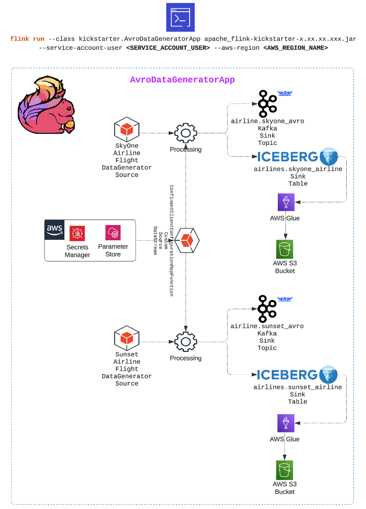
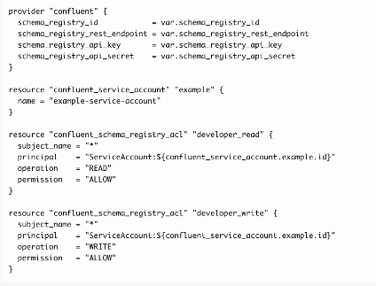
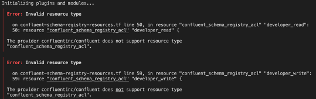
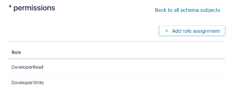

# Unlocking Schema Registry Access: Granting Confluent Service Account Permissions with Terraform
_Have you ever had that moment when you're deep into a project, complete it, and then a sudden realization hits you like a jolt of caffeine: your code doesn't have the proper resource permissions when you go to do the final test run before the release? Ugh! Right!_ 😉


I recently found myself knee-deep in such an adventure. I was crafting a [demo Java Flink app](https://github.com/j3-signalroom/apache_flink-kickstarter) (see architectural drawing below) that generates synthetic flight data. This app produces Kafka Topics in Avro data format and stores them in Apache Iceberg tables. So far, so good.



But here's where the plot thickens.

## The Serialization Challenge
To get everything humming smoothly, I needed to serialize the data to a specific Confluent Avro schema using a SpecificRecord class object. If the schema doesn't exist in the Confluent Schema Registry, the app must create it on the fly. It's like teaching your data streams a new language as they flow!

**But there's a catch:** The app's service account needs **read and write permissions** - specifically, the [`DeveloperRead`](https://docs.confluent.io/platform/current/schema-registry/security/rbac-schema-registry.html#role-mappings-to-operations-for-subject-based-authorization) and [`DeveloperWrite`](https://docs.confluent.io/platform/current/schema-registry/security/rbac-schema-registry.html#role-mappings-to-operations-for-subject-based-authorization) predefined roles, respectively - to the Schema Registry Cluster. Without this, my app would be all dressed up with nowhere to go.

## Terraform to the Rescue?
Being a big fan of infrastructure as code (and who isn't these days?), I wanted to manage these permissions using Terraform. After all, why click buttons when you can automate?

I knew about the [`confluent_kafka_acl`](https://registry.terraform.io/providers/confluentinc/confluent/latest/docs/resources/confluent_kafka_acl) resource in the Confluent Terraform Provider lets you easily manage Kafka ACLs. But what about Schema Registry ACLs? Is there a Terraform resource for that?

## A Chat with My AI Sidekick
Enter my friendly AI chatbot. I decided to pick its virtual brain.

I asked, _"How to give a service account permission to DeveloperRead and DeveloperWrite in all Subjects in the Schema Registry using Terraform."_  And, this was the response:



So, I added it to my Terraform script and ran it. This is what I got:



## So disappointed


I was thrilled - for about a nanosecond. AI Chatbots are excellent, but they are not infallible. **A wise lesson is always to double-check your AI's answers.**

## So, back to the tried & true
Undeterred, I _jogged my memory and remembered_ that Confluent does have a resource I used before that allowed me to [set permissions on my Flink resources](https://github.com/j3-signalroom/apache_flink-kickstarter/blob/main/confluent-flink-resources.tf), which should work for granting permissions to the Schema Registry Cluster. As it turns out, it does! Below is the code:

```hcl
resource "confluent_role_binding" "schema_registry_developer_read_all_subjects" {
  principal   = "User:${confluent_service_account.schema_registry_cluster_api.id}"
  role_name   = "DeveloperRead"
  crn_pattern = "${data.confluent_schema_registry_cluster.env.resource_name}/subject=*"

  depends_on = [ 
    confluent_service_account.schema_registry_cluster_api,
    data.confluent_schema_registry_cluster.env 
  ]
}

resource "confluent_role_binding" "schema_registry_developer_write_all_subjects" {
  principal   = "User:${confluent_service_account.schema_registry_cluster_api.id}"
  role_name   = "DeveloperWrite"
  crn_pattern = "${data.confluent_schema_registry_cluster.env.resource_name}/subject=*"

  depends_on = [ 
    confluent_service_account.schema_registry_cluster_api,
    data.confluent_schema_registry_cluster.env 
  ]
}
```

This is how it looks in the Confluent Cloud web console:



### **`resource "confluent_role_binding" "schema_registry_developer_read_all_subjects"`** code breakdown:

This Terraform code creates a resource for assigning a role binding in Confluent Cloud, expressly granting a [`DeveloperRead`](https://docs.confluent.io/platform/current/schema-registry/security/rbac-schema-registry.html#role-mappings-to-operations-for-subject-based-authorization) role for all Schema Registry subjects in a specific Confluent **Schema Registry cluster**.  It also ensures that the role binding only happens once the necessary service account and Schema Registry cluster resources are available.

**`resource "confluent_role_binding" "schema_registry_developer_read_all_subjects"`**:
   - This declares a Terraform resource of type `confluent_role_binding` to create a role binding in Confluent Cloud.
   - The resource is named `"schema_registry_developer_read_all_subjects"`, which means you can reference it in the configuration by this name.

**`principal = "User:${confluent_service_account.schema_registry_cluster_api.id}"`**:
   - The `principal` is the entity to which the role is assigned.
   - Here, the `principal` is defined as a **user** and is specified using the **service account ID**: `${confluent_service_account.schema_registry_cluster_api.id}`.
   - The `confluent_service_account.schema_registry_cluster_api.id` references an existing service account resource previously defined in Terraform.

**`role_name = "DeveloperRead"`**:
   - The `role_name` is the **role being assigned** to the principal.
   - In this case, the role is `"DeveloperRead"`, which grants **read access** to the resource (in this context, it's read access to Schema Registry subjects).

**`crn_pattern = "${data.confluent_schema_registry_cluster.env.resource_name}/subject=*"`**:
   - The `crn_pattern` defines the **scope of access** for this role binding, indicating which resources the role can access.
   - In this case, `${data.confluent_schema_registry_cluster.env.resource_name}` references the Confluent Schema Registry cluster resource, and the `/subject=*` pattern specifies **all subjects** in the Schema Registry.
   - Essentially, this role binding is granting read access to **all subjects** in the Schema Registry.

**`depends_on`**:
   - The `depends_on` attribute specifies **dependencies** to ensure resources are created in the correct order.
   - The role binding depends on two resources:
     - `confluent_service_account.schema_registry_cluster_api`: The service account that will be assigned the role must exist first.
     - `data.confluent_schema_registry_cluster.env`: The Schema Registry cluster must also be available before the role binding is created.
   - Using `depends_on` makes sure that Terraform creates these dependencies before creating the role binding.

### **`resource "confluent_role_binding" "schema_registry_developer_write_all_subjects"`** code breakdown:

This Terraform code creates a resource for assigning a role binding in Confluent Cloud, expressly granting a [`DeveloperWrite`](https://docs.confluent.io/platform/current/schema-registry/security/rbac-schema-registry.html#role-mappings-to-operations-for-subject-based-authorization) role for all Schema Registry subjects in a specific Confluent **Schema Registry cluster**.  It also ensures that the role binding only happens once the necessary service account and Schema Registry cluster resources are available.

**`resource "confluent_role_binding" "schema_registry_developer_write_all_subjects"`**:
   - This declares a Terraform resource of type `confluent_role_binding` to create a role binding in Confluent Cloud.
   - The resource is named `"schema_registry_developer_write_all_subjects"`, which means you can reference it in the configuration by this name.

**`principal = "User:${confluent_service_account.schema_registry_cluster_api.id}"`**:
   - The `principal` is the entity to which the role is assigned.
   - Here, the `principal` is defined as a **user** and is specified using the **service account ID**: `${confluent_service_account.schema_registry_cluster_api.id}`.
   - The `confluent_service_account.schema_registry_cluster_api.id` references an existing service account resource previously defined in Terraform.

**`role_name = "DeveloperWrite"`**:
   - The `role_name` is the **role being assigned** to the principal.
   - In this case, the role is `"DeveloperWrite"`, which grants **write access** to the resource (in this context, it's write access to Schema Registry subjects).

**`crn_pattern = "${data.confluent_schema_registry_cluster.env.resource_name}/subject=*"`**:
   - The `crn_pattern` defines the **scope of access** for this role binding, indicating which resources the role can access.
   - In this case, `${data.confluent_schema_registry_cluster.env.resource_name}` references the Confluent Schema Registry cluster resource, and the `/subject=*` pattern specifies **all subjects** in the Schema Registry.
   - Essentially, this role binding is granting read access to **all subjects** in the Schema Registry.

**`depends_on`**:
   - The `depends_on` attribute specifies **dependencies** to ensure resources are created in the correct order.
   - The role binding depends on two resources:
     - `confluent_service_account.schema_registry_cluster_api`: The service account that will be assigned the role must exist first.
     - `data.confluent_schema_registry_cluster.env`: The Schema Registry cluster must also be available before the role binding is created.
   - Using `depends_on` makes sure that Terraform creates these dependencies before creating the role binding.


