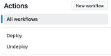
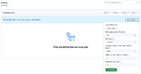

#  Apache Flink Kickstarter using  & 
This project showcases the exceptional capabilities of Apache Flink, known for its high performance, scalability, and advanced stream processing features, which is a core component of the signalRoom technology stack. Staying true to our mission of empowering developers by sharing practical knowledge, we demonstrate the use of Flink through real-world examples based on the blog series ["Building Apache Flink Applications in Java."](https://developer.confluent.io/courses/flink-java/overview/)

Flink App|Description
-|-
`DataGeneratorApp`|This Flink App generates realistic flight data for the fictional airlines Sunset Air and Sky One Airlines, seamlessly integrating modern data streaming technologies. Flight events are published to dedicated Kafka topics (`airline.sunset` and `airline.skyone`), enabling real-time processing and analysis. Simultaneously, the synthetic data flows into Apache Iceberg tables , stored in an AWS S3 bucket, providing a robust, scalable foundation for historical data analytics.  The entire solution is implemented in Java, overcoming limitations in PyFlink, which currently lacks a Python-based data generator source. This design ensures a powerful, flexible data pipeline, ideal for both real-time and batch use cases. 
`FlightImporterApp`|Imports flight data from `airline.sunset` and `airline.skyone` Kafka topics and standardizes them into a unified `airline.all` Kafka topic. Implemented in both Java and Python.
`FlyerStatsApp`|Processes data from the `airline.all` Kafka topic to aggregate flyer statistics into the `airline.flyer_stats` Kafka topic. Implemented in both Java and Python.

Created by [Wade Waldron](https://www.linkedin.com/in/wade-waldron/), Staff Software Practice Lead at [Confluent Inc.](https://www.confluent.io/), these applications are designed to handle enterprise-scale use cases to demonstrate Flink's potential for real-world applications. This will start with securely fetching Kafka Cluster API keys via _**AWS Secrets Manager**_ and retrieving essential Kafka client configuration properties through the _**AWS Systems Manager Parameter**_.

Beyond simply transforming and enriching data, we stream it into Kafka topics and _**Apache Iceberg tables**_, designed for high-performance, large-scale analytics with support for ACID transactions, offering highly scalable, real-time data processing and durable storage.

Our journey with Flink doesn’t end with Java; Python-based Flink applications also shine in this project, leveraging Flink SQL, Table API, and DataFrame API, each offering unique advantages: Flink SQL for declarative queries, Table API for a mix of SQL-like syntax and programmatic control, and DataFrame API for efficient data manipulation similar to pandas or R. This provides a seamless, flexible approach to solving complex streaming challenges, ultimately unlocking an efficient and scalable architecture for modern data needs.

Explore the repo, run the Docker containers (compatible with both Mac M chips and non-Mac M chips), and see how Apache Flink can be utilized to build robust, enterprise-grade streaming applications.

**Table of Contents**

<!-- toc -->
+ [1.0 Are these examples better described as Flink Jobs or Flink Applications-—and why does the distinction matter?](#10-are-these-examples-better-described-as-flink-jobs-or-flink-applications-and-why-does-the-distinction-matter)
+ [2.0 Let's get started!](#20-lets-get-started)
    - [2.1 DevOps in Action: Running Terraform Locally](#21-devops-in-action-running-terraform-locally)
        + [2.1.1 Run locally](#211-run-locally)
    - [2.2 DevOps in Action: Running Terraform in the cloud](#22-devops-in-action-running-terraform-in-the-cloud)
        + [2.2.1 Run from the cloud](#221-run-from-the-cloud)
+ [3.0 Kickstart examples!](#30-kickstart-examples)
    - [3.1 Java-based Flink Apps](#31-java-based-flink-apps)
    - [3.2 Python-based Flink Apps](#32-python-based-flink-apps)
+ [4.0 Resources](#40-resources)
+ [5.0 Important Note(s)](#50-important-notes)
<!-- tocstop -->

## 1.0 Are these examples better described as Flink Jobs or Flink Applications-—and why does the distinction matter?

> _"What's in a name? That which we call a rose by any other name would smell just as sweet."_
>
> -- _William Shakespeare_

Did you know Flink jobs are often called Flink applications? It’s not just a fancy name upgrade—there’s a good reason behind it! Unlike a single task or computation, a Flink job is like a mini software ecosystem. Calling it an 'application' captures its true essence: a complex, integrated workflow that solves big data challenges, just like any full-fledged software app.

By using 'Flink applications,' we're emphasizing their depth and sophistication. It’s not just about crunching numbers; it’s about building something comprehensive, dynamic, and powerful—just like any great app you use every day. (Curious for more details? Check out the rationale [here](.blog/rationale-behind-calling-it-flink-app.md)!)

## 2.0 Let's get started!

Ready to supercharge your data streaming skills? As of October 4, 2024, Apache Flink on Confluent Cloud brings incredible possibilities and a few challenges! Currently, it doesn't support the DataStream API, and its Table API is limited (click [here](https://github.com/confluentinc/flink-table-api-python-examples?tab=readme-ov-file#supported-api) for a list of what is supported) to creating Java or Python-based Flink applications. Don't worry, though—we've got you covered!

In this repo, you'll find an example code where we use the Java DataStream API to create a **_custom source_** beyond Flink's typical capabilities. Imagine making external calls to AWS Secrets Manager to securely retrieve Kafka Cluster API Key secrets or pulling Kafka consumer and producer client configuration properties from the AWS Systems Manager Parameter Store—all directly integrated into Flink!

Prefer Python? We've got you there too. With the Table API, you can use a **_User-Defined Table Function_** to do the same. Plus, we don't just sink data into Kafka topics; this repo showcases how to store it in **_Apache Iceberg tables_**, unlocking even more power for your data.

To help you start quickly, the repo comes with **_Docker containers_** for Mac M chip and non-Mac M chip machines, letting you run an Apache Flink 1.19.1 cluster locally. For the Kafka and Schema Registry resources, we're fully leveraging Confluent Cloud. Dive in and explore—the future of data streaming is here!

**These are the steps**

1. Take care of the cloud and local environment prequisities listed below:
    > You need to have the following cloud accounts:
    > - [AWS Account](https://signin.aws.amazon.com/) *with SSO configured*
    > - [Confluent Cloud Account](https://confluent.cloud/)
    > - [Docker Account](https://docker.com)
    > - [GitHub Account](https://github.com) *with OIDC configured for AWS*
    > - [Snowflake Account](https://app.snowflake.com/)
    > - [Terraform Cloud Account](https://app.terraform.io/)

    > You need to have the following installed on your local machine:
    > - [AWS CLI version 2](https://docs.aws.amazon.com/cli/latest/userguide/getting-started-install.html)
    > - [Confluent CLI version 3 or higher](https://docs.confluent.io/confluent-cli/4.0/overview.html)
    > - [Docker Desktop](https://www.docker.com/products/docker-desktop/)
    > - [Java JDK (Java Development Kit) 11](https://www.oracle.com/java/technologies/javase/jdk11-archive-downloads.html)
    > - [Python 3.11](https://www.python.org/downloads/release/python-3119/)
    > - [Terraform CLI version 1.93 or higher](https://developer.hashicorp.com/terraform/install)

2. Clone the repo:
    ```bash
    git clone https://github.com/j3-signalroom/apache_flink-kickstarter.git
    ```

3. Set up your Terraform Cloud environment locally or leverage GitHub Actions to create the complete setup effortlessly. Here's what you can expect:

    - A Confluent Cloud environment featuring a Kafka Cluster, fully equipped with pre-configured example Kafka topics—ready to power your data streaming needs.

    - AWS Secrets Manager securely storing API Key Secrets for the Kafka Cluster, along with AWS Systems Manager Parameter Store containing Kafka Consumer and Producer properties for easy integration.

    - An AWS S3 bucket with a dedicated `warehouse` folder, serving as the landing zone for Apache Iceberg tables populated by two Python-based Flink apps, bringing your data streaming architecture to life.

4. Run Apache Flink locally on your Mac, or use the provided Docker containers from the project to launch Apache Flink and Apache Iceberg seamlessly on your machine.

With these steps, you'll have everything set up to run enterprise-grade data streaming applications in no time!

### 2.1 DevOps in Action: Running Terraform Locally
Install the [Terraform CLI](https://developer.hashicorp.com/terraform/tutorials/aws-get-started/install-cli) on your local machine, and make sure you have an [HCP Terraform account](https://app.terraform.io/session) to run the Terraform configuration.  Learn how to set up Terraform Cloud for local use by clicking [here](.blog/setup-terraform-cloud.md).

#### 2.1.1 Run locally
```bash
scripts/run-terraform-locally.sh <create | delete> --profile=<SSO_PROFILE_NAME>
                                                   --confluent-api-key=<CONFLUENT_API_KEY>
                                                   --confluent-api-secret=<CONFLUENT_API_SECRET>
                                                   --snowflake-warehouse=<SNOWFLAKE_WAREHOUSE>
                                                   --service-account-user=<SERVICE_ACCOUNT_USER>
                                                   --day-count=<DAY_COUNT>
                                                   --auto-offset-reset=<earliest | latest>
                                                   --number-of-api-keys-to-retain=<NUMBER_OF_API_KEYS_TO_RETAIN>
```
> Argument placeholder|Replace with
> -|-
> `<SSO_PROFILE_NAME>`|your AWS SSO profile name for your AWS infrastructue that host your AWS Secrets Manager.
> `<CONFLUENT_API_KEY>`|your organization's Confluent Cloud API Key (also referred as Cloud API ID).
> `<CONFLUENT_API_SECRET>`|your organization's Confluent Cloud API Secret.
> `<SNOWFLAKE_WAREHOUSE>`|the Snowflake warehouse (or "virtual warehouse") you choose to run the resources in Snowflake.
> `<SERVICE_ACCOUNT_USER>`|the Snowflake service account user who is to be assigned the RSA key pairs for its authentication.
> `<DAY_COUNT>`|how many day(s) should the API Key be rotated for.
> `<AUTO_OFFSET_RESET>`|Use `earliest`, when you want to read the first event in a Kafka topic.  Otherwise, specify `latest`.
> `<NUMBER_OF_API_KEYS_TO_RETAIN>`|Specifies the number of API keys to create and retain.

To learn more about this script, click [here](.blog/run-terraform-locally-script-explanation.md).

### 2.2 DevOps in Action: Running Terraform in the cloud
In order to run the Terraform configuration from GitHub, the Terraform Cloud API token and Confluent Cloud API Key are required as GitHub Secret variables.  Learn how to do to get the Terraform Cloud API token and Confluent Cloud API key [here](.blog/setup-github.md).

#### 2.2.1 Run from the cloud
Follow these steps:

a. **Deploy the Repository**: Ensure that you have cloned or forked the repository to your GitHub account.

b. **Set Required Secrets and Variables**: Before running any of the GitHub workflows provided in the repository, you must define at least the `AWS_DEV_ACCOUNT_ID` variable (which should contain your AWS Account ID for your development environment). To do this:

- Go to the **Settings** of your cloned or forked repository in GitHub.

- Navigate to **Secrets and Variables** > **Actions**.

- Add the `AWS_DEV_ACCOUNT_ID` and any other required variables or secrets.

c. **Navigate to the Actions Page**:

- From the cloned or forked repository on GitHub, click on the **Actions** tab.

d. **Select and Run the Deploy Workflow**:

- Find the **Deploy workflow** link on the left side of the Actions page and click on it.

    

- On the **Deploy workflow** page, click the **Run workflow** button.

- A workflow dialog box will appear. Fill in the necessary details and click **Run workflow** to initiate the Terraform deployment process.

    

By following these steps, you will run the Terraform configuration directly from GitHub, leveraging GitHub Actions for automation and deployment.

## 3.0 Kickstart examples!

### 3.1 Java-based Flink Apps
[Let's get started!](java/README.md)

### 3.2 Python-based Flink Apps
[Let's get started!](python/README.md)

## 4.0 Resources

[Apache Flink's Core is Dataflow Programming](https://en.wikipedia.org/wiki/Dataflow_programming)

[What is Apache Flink? — Architecture](https://flink.apache.org/what-is-flink/flink-architecture/)

[Apache Flink Use Cases](https://flink.apache.org/what-is-flink/use-cases/)

[Building Apache Flink Applications in Java](https://developer.confluent.io/courses/flink-java/overview/)

[J3's techStack Lexicon](https://github.com/j3-signalroom/j3-techstack-lexicon/blob/main/README.md)

## 5.0 Important Note(s)
[Known Issue(s)](KNOWNISSUES.md)