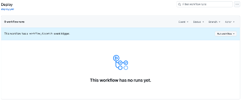

#  Apache Flink Kickstarter
This repository showcases the exceptional capabilities of Apache Flink, known for its high performance, scalability, and advanced stream processing features, which is a core component of the signalRoom technology stack. Staying true to our mission of empowering developers by sharing practical knowledge, we demonstrate the use of Flink through real-world examples based on the blog series ["Building Apache Flink Applications in Java."](https://developer.confluent.io/courses/flink-java/overview/)

Flink App|Description
-|-
`DataGeneratorApp`|Generates realistic flight data for fictional airlines **Sunset Air** and **Sky One** Airlines, publishing to Kafka topics `airline.sunset` and `airline.skyone`. Implemented in Java, as PyFlink lacks a data generator source for Python.
`FlightImporterApp`|Imports flight data from `airline.sunset` and `airline.skyone` Kafka topics and standardizes them into a unified `airline.all` Kafka topic. Implemented in both Java and Python.
`UserStatisticsApp`|Processes data from the `airline.all` Kafka topic to aggregate user statistics into the `airline.user_statistics` Kafka topic. Implemented in both Java and Python.

Created by [Wade Waldron](https://www.linkedin.com/in/wade-waldron/), Staff Software Practice Lead at [Confluent Inc.](https://www.confluent.io/), these applications are designed to handle enterprise-scale use cases to demonstrate Flink's potential for real-world applications. This will start with securely fetching Kafka Cluster API keys via _**AWS Secrets Manager**_ and retrieving essential Kafka client configuration properties through the _**AWS Systems Manager Parameter**_.

Beyond simply transforming and enriching data, we stream it into Kafka topics and _**Apache Iceberg tables**_, designed for high-performance, large-scale analytics with support for ACID transactions, offering highly scalable, real-time data processing and durable storage.

Our journey with Flink doesn’t end with Java; Python-based Flink applications also shine in this repository, leveraging Flink SQL, Table API, and DataFrame API, each offering unique advantages: Flink SQL for declarative queries, Table API for a mix of SQL-like syntax and programmatic control, and DataFrame API for efficient data manipulation similar to pandas or R. This provides a seamless, flexible approach to solving complex streaming challenges, ultimately unlocking an efficient and scalable architecture for modern data needs.

Explore the repo, run the Docker containers (compatible with both Mac M chips and non-Mac M chips), and see how Apache Flink can be utilized to build robust, enterprise-grade streaming applications.

**Table of Contents**

<!-- toc -->
+ [1.0 What do we call these examples, Flink Jobs or Flink Applications?](#10-what-do-we-call-these-examples-flink-jobs-or-flink-applications)
+ [2.0 Let's get started!](#20-lets-get-started)
    - [2.1 DevOps in Action with Terraform ran locally](#21-devops-in-action-with-terraform-ran-locally)
        + [2.1.1 Run Terraform locally](#211-run-terraform-locally)
    - [2.2 DevOps in Action with GitHub, running Terraform in the cloud](#22-devops-in-action-with-github-running-terraform-in-the-cloud)
        + [2.2.1 Deploy Terraform from the cloud](#221-deploy-terraform-from-the-cloud)
    - [2.3 Power up the Apache Flink Docker containers](#23-power-up-the-apache-flink-docker-containers)
+ [3.0 Examples to get you kickstarted!](#30-examples-to-get-you-kickstarted)
    - [3.1 Java-based Flink Apps](#31-java-based-flink-apps)
    - [3.2 Python-based Flink Apps](#32-python-based-flink-apps)
+ [4.0 Resources](#40-resources)
<!-- tocstop -->

## 1.0 What do we call these examples, Flink Jobs or Flink Applications?

> _"What's in a name? That which we call a rose by any other name would smell just as sweet."_
>
> -- _William Shakespeare_

Flink jobs are often called Flink applications because they encompass more than just a single task or computation. The term "application" better reflects the nature and scope of what is being developed and executed in Apache Flink.  (See [here](.blog/rationale-behind-calling-it-flink-app.md) for the rationale behind this reasoning.)  By calling Flink jobs "Flink applications," it emphasizes the comprehensive, complex, and integrated nature of the work, aligning it more closely with how we think about and manage software applications in general.

## 2.0 Let's get started!

Ready to supercharge your data streaming skills? As of October 4, 2024, Apache Flink on Confluent Cloud brings incredible possibilities and a few challenges! Currently, it doesn't support the DataStream API, and its Table API is limited (click [here](https://github.com/confluentinc/flink-table-api-python-examples?tab=readme-ov-file#supported-api) for a list of what is supported) to creating Java or Python-based Flink applications. Don't worry, though—we've got you covered!

In this repo, you'll find an example code where we use the Java DataStream API to create a **_custom source_** beyond Flink's typical capabilities. Imagine making external calls to AWS Secrets Manager to securely retrieve Kafka Cluster API Key secrets or pulling Kafka consumer and producer client configuration properties from the AWS Systems Manager Parameter Store—all directly integrated into Flink!

Prefer Python? We've got you there too. With the Table API, you can use a **_User-Defined Table Function_** to do the same. Plus, we don't just sink data into Kafka topics; this repo showcases how to store it in **_Apache Iceberg tables_**, unlocking even more power for your data.

To help you start quickly, the repo comes with **_Docker containers_** for Mac M chip and non-Mac M chip machines, letting you run an Apache Flink 1.19.1 cluster locally. For the Kafka and Schema Registry resources, we're fully leveraging Confluent Cloud. Dive in and explore—the future of data streaming is here!

**These are the steps**

1. Take care of the cloud and local environment prequisities listed below:
    > You need to have the following cloud accounts:
    > - [AWS Account](https://signin.aws.amazon.com/) *with SSO configured*
    > - [Confluent Cloud Account](https://confluent.cloud/)
    > - [Docker Account](https://docker.com)
    > - [GitHub Account](https://github.com) *with OIDC configured for AWS*
    > - [Snowflake Account](https://app.snowflake.com/)
    > - [Terraform Cloud Account](https://app.terraform.io/)

    > You need to have the following installed on your local machine:
    > - [AWS CLI version 2](https://docs.aws.amazon.com/cli/latest/userguide/getting-started-install.html)
    > - [Confluent CLI version 3 or higher](https://docs.confluent.io/confluent-cli/4.0/overview.html)
    > - [Docker Desktop](https://www.docker.com/products/docker-desktop/)
    > - [Java JDK (Java Development Kit) 11](https://www.oracle.com/java/technologies/javase/jdk11-archive-downloads.html)
    > - [Python 3.11](https://www.python.org/downloads/release/python-3119/)
    > - [Terraform CLI version 1.85 or higher](https://developer.hashicorp.com/terraform/install)

2. Clone the repo:
    ```bash
    git clone https://github.com/j3-signalroom/apache_flink-kickstarter.git
    ```

3. Set up your Terraform Cloud environment locally, or use [GitHub workflow/actions](.github/workflows/deploy.yml), so you can:

    - Have your Confluent Cloud environment with a Kafka Cluster that uses the example Kafka topics and their schemas in the Schema Registry set up for you.

    - Have your AWS Secrets Manager store API Key Secrets for Kafka Cluster and Schema Registry Cluster, along with the Kafka properties for Consumer and Producer, in the AWS Systems Parameter Store, set up for you.  An AWS S3 Bucket is also created as the landing spot for the Apache Iceberg files generated by the Flink Apps (a.k.a. Flink Jobs).

4. Run Apache Flink on your Mac locally, or Power up the Docker containers that run Apache Flink and Apache Iceberg locally on your machine.

### 2.1 DevOps in Action with Terraform ran locally
Install the [Terraform CLI](https://developer.hashicorp.com/terraform/tutorials/aws-get-started/install-cli) on your local machine, and make sure you have an [HCP Terraform account](https://app.terraform.io/session) to run the Terraform configuration.  Learn how to set up Terraform Cloud for local use by clicking [here](.blog/setup-terraform-cloud.md).

#### 2.1.1 Run Terraform locally
```bash
scripts/run-terraform-locally.sh --profile=<PROFILE_NAME> --confluent_cloud_api_key=<CONFLUENT_CLOUD_API_KEY> --confluent_cloud_api_secret=<CONFLUENT_CLOUD_API_SECRETS> 
```

### 2.2 DevOps in Action with GitHub, running Terraform in the cloud
In order to run the Terraform configuration from GitHub, the Terraform Cloud API token and Confluent Cloud API Key are required as GitHub Secret variables.  Learn how to do to get the Terraform Cloud API token and Confluent Cloud API key [here](.blog/setup-github.md).

#### 2.2.1 Deploy Terraform from the cloud
From the repo on GitHub, go to [GitHub Actions](https://github.com/j3-signalroom/apache_flink-kickstarter/actions), for instance (see screenshot below):


Click the `Deploy` workflow, and the Deploy page will be displayed (see screenshot below):



Click `Run workflow` button, and the Deploy dialog box will be displayed (see screenshot below):


Then fill out the Deploy dialog box, and click the `Run workflow` button to deploy the Terraform configuration.

### 2.3 Power up the Apache Flink Docker containers

> **Prerequisite**
> 
> Before you can run `scripts/run-flink-locally.sh` Bash script, you need to install the [`aws2-wrap`](https://pypi.org/project/aws2-wrap/#description) utility.  If you have a Mac machine, run this command from your Terminal:
> ````bash
> brew install aws2-wrap
> ````
>
> Or, make sure you have Python3.x installed on your machine, and run this command from your Terminal:
> ```bash
> pip install aws2-wrap
> ```

This section guides you through the local setup (on one machine but in separate containers) of the Apache Flink cluster in Session mode using Docker containers with support for Apache Iceberg.  Run the `bash` script below to start the Apache Flink cluster in Session Mode on your machine:

```bash
scripts/run-flink-locally.sh <on | off> --profile=<AWS_SSO_PROFILE_NAME> --chip=<amd64 | armd64> [--aws_s3_bucket=<AWS_S3_BUCKET_NAME>]
```
Argument placeholder|Replace with
    -|-
    `<on | off>`|use `on` to turn on Flink locally, otherwise `off` to turn Flink off.
    `<AWS_SSO_PROFILE_NAME>`|your AWS SSO profile name for your AWS infrastructue that host your AWS Secrets Manager.
    `<amd64 | armd64>`|if you are running on a Mac with M1, M2, or M3 chip, use `arm64`.  Otherwise, use `amd64`.
    `<AWS_S3_BUCKET_NAME>`|**[Optional]** can specify the name of the AWS S3 bucket used to store Apache Iceberg files.

## 3.0 Examples to get you kickstarted!

### 3.1 Java-based Flink Apps
[Let's get started!](java/README.md)

### 3.2 Python-based Flink Apps
[Let's get started!](python/README.md)

## 4.0 Resources

[Apache Flink's Core is Dataflow Programming](https://en.wikipedia.org/wiki/Dataflow_programming)

[What is Apache Flink? — Architecture](https://flink.apache.org/what-is-flink/flink-architecture/)

[Apache Flink Use Cases](https://flink.apache.org/what-is-flink/use-cases/)

[Building Apache Flink Applications in Java](https://developer.confluent.io/courses/flink-java/overview/)

[J3's techStack Lexicon](https://github.com/j3-signalroom/j3-techstack-lexicon/blob/main/README.md)
