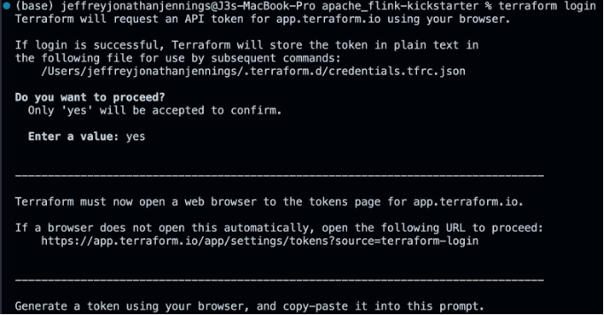
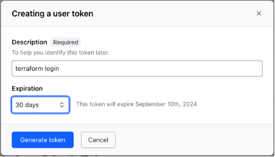
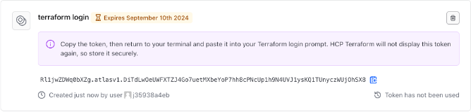
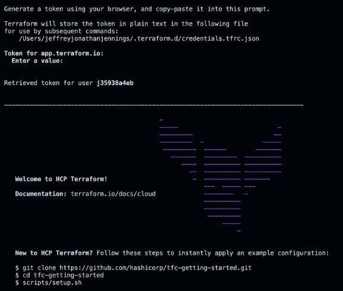

# Apache Flink Kickstarter

**Table of Contents**

<!-- toc -->
+ [You can call it a Flink Job or a Flink Application?](#you-can-call-it-a-flink-job-or-a-flink-application)
    - [Comprehensive Nature](#comprehensive-nature)
    - [Execution Context](#execution-context)
    - [Deployment and Operations](#deployment-and-operations)
    - [Development Perspective](#development-perspective)
    - [Ecosystem Integration](#ecosystem-integration)
    - [Terminology and Communication](#terminology-and-communication)
+ [Examples to get you kickstarted!](#examples-to-get-you-kickstarted)
    - [Java Examples](#java-examples)
    - [Python Examples](#python-examples)
+ [How to use this repo?](#how-to-use-this-repo)
    - [Set up your Terraform Cloud environment](#set-up-your-terraform-cloud-environment)
        + [Terraform Cloud API token](#terraform-cloud-api-token)
            - [Set up your Confluent Cloud environment](#set-up-your-confluent-cloud-environment)
                + [Create a `terraform.tfvars` file in the root of the repo](#create-a-terraformtfvars-file-in-the-root-of-the-repo)
                + [AWS Secrets Manager](#aws-secrets-manager)
                + [AWS Systems Manager Parameter Store](#aws-systems-manager-parameter-store)
        + [Run the Terraform configuration](#run-the-terraform-configuration)
    - [Power up the Apache Flink Docker containers](#power-up-the-apache-flink-docker-containers)
+ [Resources](#resources)
<!-- tocstop -->

## You can call it a Flink Job or a Flink Application?

> _"What's in a name? That which we call a rose by any other name would smell just as sweet." -- William Shakespeare_

Flink jobs are often called Flink applications because they encompass more than just a single task or computation. The term "application" better reflects the nature and scope of what is being developed and executed in Apache Flink. Here are several reasons why the term "Flink applications" is used:

### Comprehensive Nature
1. **Complex Workflows**: Flink jobs often represent complex workflows that include multiple stages of data processing, such as data ingestion, transformation, aggregation, and output. These workflows can be intricate and involve various interconnected operations, similar to a traditional application.

2. **Multiple Components**: A Flink job can consist of various components, such as sources, transformations, sinks, and custom functions. These components work together to perform a coherent set of tasks, much like the components of a traditional software application.

### Execution Context
3. **Runtime Environment**: When a Flink job is deployed, it runs in a distributed environment, utilizing the Flink runtime for resource management, task scheduling, and fault tolerance. This execution context is similar to how applications run on a platform or infrastructure.

4. **State Management**: Flink supports stateful stream processing, where the state is managed and maintained across different operations and executions. Managing state adds a layer of complexity and functionality typical of applications.

### Deployment and Operations
5. **Deployment**: Flink jobs are deployed to a cluster, where they run continuously (in the case of streaming jobs) or as batch jobs. This deployment and operational aspect aligns more with how applications are managed and executed rather than simple scripts or tasks.

6. **Monitoring and Maintenance**: Like applications, Flink jobs require monitoring, logging, and maintenance. They often need to handle operational concerns such as scaling, updating, and fault tolerance.

### Development Perspective
7. **Development Lifecycle**: The development of Flink jobs follows a lifecycle similar to software applications, including design, coding, testing, and deployment. Developers often use IDEs, version control systems, and CI/CD pipelines, which are standard tools for application development.

8. **Reusability and Modularity**: Flink jobs can be designed to be modular and reusable. Developers can create libraries and frameworks on top of Flink to facilitate the development of multiple jobs, much like application development.

### Ecosystem Integration
9. **Integration with Other Systems**: Flink applications often integrate with other systems and services such as databases, message queues, and cloud services. This integration is typical of applications that operate within an ecosystem of other software systems.

### Terminology and Communication
10. **Clear Communication**: Referring to Flink jobs as applications helps convey the complexity and importance of the work being done. It sets appropriate expectations for stakeholders about the scope and nature of the project.

By calling Flink jobs "Flink applications," it emphasizes the comprehensive, complex, and integrated nature of the work, aligning it more closely with how we think about and manage software applications in general.

## Examples to get you kickstarted!

### Java Examples
[Java examples](java/README.md)

### Python Examples
[Python examples](python/README.md)

## How to use this repo?
As of August 2024, Confluent’s Serverless Flink offering does not yet support the DataStream API and Table API for writing Flink Apps in Java or Python.  Therefore, this repo restricts the use of cloud resources to the Confluent Cloud Kafka Cluster and Schema Registry only.  It utilizes AWS Secrets Manager to store Kafka Cluster and Schema Registry API Key secrets, AWS Systems Manager Parameter Store to store Consumer and Producer Kafka configuration properties, and Terraform Cloud for Infrastructure as Code DevOps.  Locally, we will utilize Docker containers to run Apache Flink and Apache Iceberg.

**To start using the repo**

1. Set up your Terraform Cloud environment, so you can:

    a. Set up your Confluent Cloud environment with a Kafka Cluster that uses the example Kafka topics and their schemas in the Schema Registry.

    b. Set up your AWS Secrets Manager to store Kafka Cluster and Schema Registry Cluster API Key Secrets, respectively, along with the Consumer and Producer Kafka properties in the AWS Systems Parameter Store.

2. Power up the Docker containers that run Apache Flink and Apache Iceberg locally on your machine.

### Set up your Terraform Cloud environment
Install the [Terraform CLI](https://developer.hashicorp.com/terraform/tutorials/aws-get-started/install-cli) on your local machine.  Then ensure you have an [HCP Terraform account](https://app.terraform.io/session) to run the Terraform configuration provided in the cloud.

#### Terraform Cloud API token
In order to authenticate with HCP Terraform, run the terraform login subcommand.  Enter `yes` to the prompt to confirm that you want to authenticate.



**Generate token**
A browser window will automatically open to the HCP Terraform login screen.  Enter a token name in the web UI, or leave the default name, `terraform login`:



Click Create API token to generate the authentication token:



Save a copy of the token in a secure location.  It provides access to your HCP Terraform organization.  Terraform will also store your token locally at the file path specified in the command output (see the picture above).

**Add the token to the CLI prompt**
When the Terraform CLI prompts you, paste the user token exactly once into your terminal.  Terraform will hide the token for security when you paste it into your terminal.  Press `Enter` to complete the authentication process:



##### Set up your Confluent Cloud environment
Then in the [main.tf](main.tf) replace **`<TERRAFORM CLOUD ORGANIZATION NAME>`** in the `terraform.cloud` block with your [Terraform Cloud Organization Name](https://developer.hashicorp.com/terraform/cloud-docs/users-teams-organizations/organizations) and **`<TERRAFORM CLOUD ORGANIZATION's WORKSPACE NAME>`** in the `terraform.cloud.workspaces` block with your [Terraform Cloud Organization's Workspaces Name](https://developer.hashicorp.com/terraform/cloud-docs/workspaces).

###### Create a `terraform.tfvars` file in the root of the repo
```
confluent_cloud_api_key = "<CONFLUENT_CLOUD_API_KEY>"
confluent_cloud_api_secret = "<CONFLUENT_CLOUD_API_SECRETS>"
aws_account_id = "<AWS_ACCOUNT_ID>"
aws_profile = "<AWS_PROFILE_NAME>"
aws_region  = "<AWS_REGION_NAME>"
number_of_api_keys_to_retain = 2
day_count = 30
auto_offset_reset = "earliest"
```

> **Confluent Cloud API**
>
> Confluent Cloud requires API keys to manage access and authentication to different parts of the service.  An API key consists of a key and a secret.  You can create and manage API keys by using the [Confluent Cloud CLI](https://docs.confluent.io/confluent-cli/current/overview.html).  Learn more about Confluent Cloud API Key access [here](https://docs.confluent.io/cloud/current/access-management/authenticate/api-keys/api-keys.html#ccloud-api-keys).
> Using the Confluent CLI, execute the follow command to generate the Cloud API Key:
> ```
> confluent api-key create --resource "cloud" 
> ```
>Then, copy-and-paste the API Key and API Secret values to the respective, `<CONFLUENT_CLOUD_API_KEY>` and `<CONFLUENT_CLOUD_API_SECRET>` property values in the `terraform.tfvars` file.

The configuration leverages the [IaC Confluent Cloud Resource API Key Rotation Terraform module](https://github.com/j3-signalroom/iac-confluent_cloud_resource_api_key_rotation-tf_module) to handle the creation and rotation of each of the Confluent Cloud Resource API Key for each of the Confluent Cloud Resources:
- [Schema Registry Cluster](https://registry.terraform.io/providers/confluentinc/confluent/latest/docs/resources/confluent_schema_registry_cluster)
- [Kafka Cluster](https://registry.terraform.io/providers/confluentinc/confluent/latest/docs/resources/confluent_kafka_cluster)
- [Kafka Topics](https://registry.terraform.io/providers/confluentinc/confluent/latest/docs/resources/confluent_kafka_topics)

Along with the Schema Registry Cluster REST endpoint, and Kafka Cluster's Bootstrap URI are stored in the [AWS Secrets Manager](https://registry.terraform.io/providers/hashicorp/aws/latest/docs/resources/secretsmanager_secret).

In addition, the [consumer](https://docs.confluent.io/platform/current/installation/configuration/consumer-configs.html) and [producer]() Kafka client configuration parameters are stored in the [AWS Systems Manager Parameter Store](https://registry.terraform.io/providers/hashicorp/aws/latest/docs/resources/ssm_parameter).

###### AWS Secrets Manager
Here is the list of secrets generated by the Terraform configuration:

**`/confluent_cloud_resource/schema_registry_cluster/java_client`**
> Key|Description
> -|-
> `basic.auth.credentials.source`|Specifies the the format used in the `basic.auth.user.info` property.
> `basic.auth.user.info`|Specifies the API Key and Secret for the Schema Registry Cluster.
> `schema.registry.url`|The HTTP endpoint of the Schema Registry cluster.

**`/confluent_cloud_resource/kafka_cluster/java_client`**
> Key|Description
> -|-
> `sasl.jaas.config`|Java Authentication and Authorization Service (JAAS) for SASL configuration.
> `bootstrap.servers`|The bootstrap endpoint used by Kafka clients to connect to the Kafka cluster.

###### AWS Systems Manager Parameter Store
Here is the list of parameters generated by the Terraform configuration:

**`/confluent_cloud_resource/consumer_kafka_client`**
> Key|Description
> -|-
> `auto.commit.interval.ms`|The `auto.commit.interval.ms` property in Apache Kafka defines the frequency (in milliseconds) at which the Kafka consumer automatically commits offsets. This is relevant when `enable.auto.commit` is set to true, which allows Kafka to automatically commit the offsets periodically without requiring the application to do so explicitly.
> `auto.offset.reset`|Specifies the behavior of the consumer when there is no committed position (which occurs when the group is first initialized) or when an offset is out of range. You can choose either to reset the position to the `earliest` offset or the `latest` offset (the default).
> `basic.auth.credentials.source`|This property specifies the source of the credentials for basic authentication.
> `client.dns.lookup`|This property specifies how the client should resolve the DNS name of the Kafka brokers.
> `enable.auto.commit`|When set to true, the Kafka consumer automatically commits the offsets of messages it has processed at regular intervals, specified by the `auto.commit.interval.ms` property. If set to false, the application is responsible for committing offsets manually.
> `max.poll.interval.ms`|This property defines the maximum amount of time (in milliseconds) that can pass between consecutive calls to poll() on a consumer. If this interval is exceeded, the consumer will be considered dead, and its partitions will be reassigned to other consumers in the group.
> `request.timeout.ms`|This property sets the maximum amount of time the client will wait for a response from the Kafka broker. If the server does not respond within this time, the client will consider the request as failed and handle it accordingly.
> `sasl.mechanism`|This property specifies the SASL mechanism to be used for authentication.
> `security.protocol`|This property specifies the protocol used to communicate with Kafka brokers.
> `session.timeout.ms`|This property sets the timeout for detecting consumer failures when using Kafka's group management. If the consumer does not send a heartbeat to the broker within this period, it will be considered dead, and its partitions will be reassigned to other consumers in the group.

**`/confluent_cloud_resource/producer_kafka_client`**
> Key|Description
> -|-
> `sasl.mechanism`|This property specifies the SASL mechanism to be used for authentication.
> `security.protocol`|This property specifies the protocol used to communicate with Kafka brokers.
> `client.dns.lookup`|This property specifies how the client should resolve the DNS name of the Kafka brokers.
> `acks`|This property specifies the number of acknowledgments the producer requires the leader to have received before considering a request complete.

#### Run the Terraform configuration
```
terraform init
```

```
terraform plan -var-file=terraform.tfvars
```

```
terraform apply -var-file=terraform.tfvars -no-approve
```

### Power up the Apache Flink Docker containers
This section guides you through the local setup (on one machine but in separate containers) of the Apache Flink cluster in Session mode using Docker containers with support for Apache Iceberg.  Run the `bash` script below to start the Apache Flink cluster in Session Mode on your machine:

> *If you are running Docker on a Mac with M1, M2, or M3 chip, set the `--chip` argument to `--chip=arm64`.  Otherwise, set it to `--chip=amd64`.  As for the `--profile` argument, specify your AWS SSO Profile Name (e.g., `--profile=AdministratorAccess-0123456789`.*

```
scripts/run-flink-locally.sh --profile=<AWS_SSO_PROFILE_NAME> --chip=<amd64 | arm64>
```

## Resources

[Apache Flink's Core is Dataflow Programming](https://en.wikipedia.org/wiki/Dataflow_programming)

[What is Apache Flink? — Architecture](https://flink.apache.org/what-is-flink/flink-architecture/)

[Apache Flink Use Cases](https://flink.apache.org/what-is-flink/use-cases/)

[Building Apache Flink Applications in Java](https://developer.confluent.io/courses/flink-java/overview/)

[J3's techStack Lexicon](https://github.com/j3-signalroom/j3-techstack-lexicon/blob/main/README.md)
