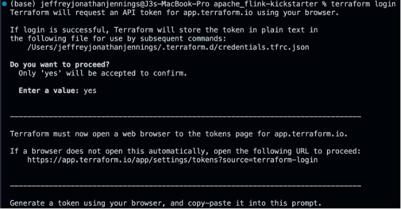
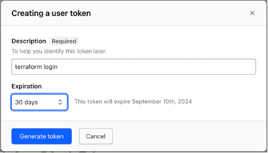
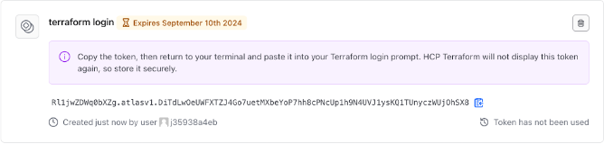
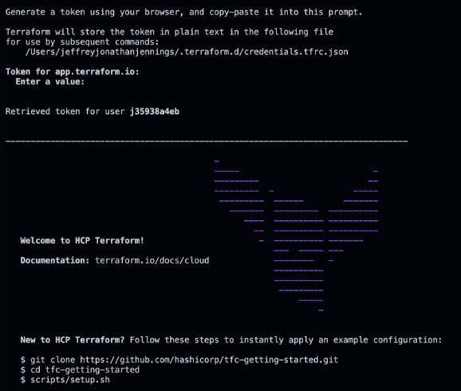

# Apache Flink Kickstarter

To kickstart your journey in the wonderful world that the creators of Apache Flink have created for us all.  J3 started with the three primary DataStream apps from the blog series on [Building Apache Flink Applications in Java](https://developer.confluent.io/courses/flink-java/overview/):

App|Description
-|-
`DataGeneratorApp`|This app creates fake flight data for fictional airlines **Sunset Air** and **Sky One** Airlines," and sends it to the Kafka topics `airline.sunset` and `airline.skyone` respectively.
`FlightImporterApp`|This app imports flight data from `airline.sunset` and `airline.skyone` Kafka topics and converts it to a unified format for the `airline.all` Kafka topic.
`UserStatisticsApp`|This app processes data from the `airline.all` Kafka topic to aggregate user statistics in the `airline.user_statistics` Kafka topic.

 Created by [Wade Waldron](https://www.linkedin.com/in/wade-waldron/), Staff Software Practice Lead at [Confluent Inc.](https://www.confluent.io/), and adapted them to showcase three additional capabilities:

No.|Capability|Description
-|-|-
1.|Read AWS Secrets Manager and AWS Systems Manager Parameter Store|Instead of relying on the local consumer and producer properties file, the Kafka Cluster API Key, and Kafka Consumer and Kafka Producer client configuration properties are read from the AWS Secrets Manager and AWS Systems Manager Parameter Store.
2.|Custom Source Data Stream|An Apache Flink custom source data stream is a user-defined source of data that is integrated into a Flink application to read and process data from non-standard or custom sources. This custom source can be anything that isn't supported by Flink out of the box, such as proprietary REST APIs, specialized databases, custom hardware interfaces, etc. J3 utilizes a Custom Source Data Stream to read the AWS Secrets Manager secrets and AWS Systems Manager Parameter Store properties during the initial start of a App, then caches the properties for use by any subsequent events that need these properties.
3.|Sinking to Apache Iceberg **(COMING SOON)**|The combination of Apache Flink and Apache Iceberg provides several advantages. Iceberg’s capabilities, including snapshot isolation for reads and writes, the ability to handle multiple concurrent operations, ACID-compliant queries, and incremental reads, enable Flink to perform operations that were traditionally challenging with older table formats. Together, they offer an efficient and scalable platform for processing large-scale data, especially for streaming use cases.

**Table of Contents**

<!-- toc -->
+ [What do we call these examples, Flink Jobs or Flink Applications?](#what-do-we-call-these-examples-flink-jobs-or-flink-applications)
    - [Comprehensive Nature](#comprehensive-nature)
    - [Execution Context](#execution-context)
    - [Deployment and Operations](#deployment-and-operations)
    - [Development Perspective](#development-perspective)
    - [Ecosystem Integration](#ecosystem-integration)
    - [Terminology and Communication](#terminology-and-communication)
+ [Let's get started](#lets-get-started)
    - [DevOps using Terraform Cloud](#devops-using-terraform-cloud)
        + [Terraform Cloud API token](#terraform-cloud-api-token)
            - [Set up your Confluent Cloud environment](#set-up-your-confluent-cloud-environment)
                + [AWS Secrets Manager](#aws-secrets-manager)
                + [AWS Systems Manager Parameter Store](#aws-systems-manager-parameter-store)
        + [Run the Terraform configuration](#run-the-terraform-configuration)
    - [GitHub set up](#github-set-up)
        + [Terraform Cloud API token for GitHub set up](#terraform-cloud-api-token-for-github-set-up)
        + [Confluent Cloud API for GitHub set up](#confluent-cloud-api-for-github-set-up)
    - [Power up the Apache Flink Docker containers](#power-up-the-apache-flink-docker-containers)
+ [Examples to get you kickstarted!](#examples-to-get-you-kickstarted)
    - [Java Examples](#java-examples)
    - [Python Examples](#python-examples)
+ [Resources](#resources)
<!-- tocstop -->

## What do we call these examples, Flink Jobs or Flink Applications?

> _"What's in a name? That which we call a rose by any other name would smell just as sweet." -- William Shakespeare_

Flink jobs are often called Flink applications because they encompass more than just a single task or computation. The term "application" better reflects the nature and scope of what is being developed and executed in Apache Flink.  (See [here](.blog/rationale-behind-calling-it-flink-app.md) for the rationale behind this reasoning.)  By calling Flink jobs "Flink applications," it emphasizes the comprehensive, complex, and integrated nature of the work, aligning it more closely with how we think about and manage software applications in general.

## Let's get started

As of August 2024, Confluent’s Serverless Flink offering does not yet support the DataStream API and Table API for writing Flink Apps in Java or Python.  Therefore, this repo restricts the use of cloud resources to the _Confluent Cloud Kafka Cluster and Schema Registry_ only.  It utilizes _AWS Secrets Manager_ to store Kafka Cluster and Schema Registry API Key secrets, _AWS Systems Manager Parameter Store_ to store Consumer and Producer Kafka configuration properties, and _Terraform Cloud for Infrastructure as Code (IaC) DevOps CI/CD_.  Locally, we will utilize Docker containers to run Apache Flink and Apache Iceberg.

**These are the steps**

1. Take care of the cloud and local environment prequisities listed below:
    > You need to have the following cloud accounts:
    > - [AWS Account](https://signin.aws.amazon.com/)
    > - [Confluent Cloud Account](https://confluent.cloud/)
    > - [Docker Account](https://docker.com)
    > - [GitHub Account](https://github.com)
    > - [Snowflake Account](https://app.snowflake.com/)
    > - [Terraform Cloud Account](https://app.terraform.io/)
    > 
    > You installed your local::
    > - [AWS CLI version 2](https://docs.aws.amazon.com/cli/latest/userguide/getting-started-install.html)
    > - [Confluent CLI version 3 or higher](https://docs.confluent.io/confluent-cli/4.0/overview.html)
    > - [Docker Desktop](https://www.docker.com/products/docker-desktop/)
    > - [Java JDK (Java Development Kit) 11](https://www.oracle.com/java/technologies/javase/jdk11-archive-downloads.html)
    > - [Python 3.11](https://www.python.org/downloads/release/python-3119/)
    > - [Terraform CLI version 1.85 or higher](https://developer.hashicorp.com/terraform/install)

2. Clone the repo:
    ```
    git clone https://github.com/j3-signalroom/apache_flink-kickstarter.git
    ```

3. Set up your Terraform Cloud environment locally, or use [GitHub workflow/actions](.github/workflows/deploy.yml), so you can:

    - Have your Confluent Cloud environment with a Kafka Cluster that uses the example Kafka topics and their schemas in the Schema Registry set up for you.

    - Have your AWS Secrets Manager to store Kafka Cluster and Schema Registry Cluster API Key Secrets, respectively, along with the Consumer and Producer Kafka properties in the AWS Systems Parameter Store set up for you.  Also, a S3 Bucket is created for the Apache Iceberg files.

4. Run Apache Flink on your Mac locally, or Power up the Docker containers that run Apache Flink and Apache Iceberg locally on your machine.

### DevOps using Terraform Cloud
Install the [Terraform CLI](https://developer.hashicorp.com/terraform/tutorials/aws-get-started/install-cli) on your local machine, and obtain an [HCP Terraform account](https://app.terraform.io/session) to run the Terraform configuration.

#### Terraform Cloud API token
In order to authenticate with HCP Terraform, run the `terraform login` CLI command.  Enter `yes` to the prompt to confirm that you want to authenticate.



**Generate token**
A browser window will automatically open to the HCP Terraform login screen.  Enter a token name in the web UI, or leave the default name, `terraform login`:



Click Create API token to generate the authentication token:



Save a copy of the token in a secure location.  It provides access to your HCP Terraform organization.  Terraform will also store your token locally at the file path specified in the command output (see the picture above).

**Add the token to the CLI prompt**
When the Terraform CLI prompts you, paste the user token exactly once into your terminal.  Terraform will hide the token for security when you paste it into your terminal.  Press `Enter` to complete the authentication process:



##### Set up your Confluent Cloud environment
Then in the [main.tf](main.tf) replace **`<TERRAFORM CLOUD ORGANIZATION NAME>`** in the `terraform.cloud` block with your [Terraform Cloud Organization Name](https://developer.hashicorp.com/terraform/cloud-docs/users-teams-organizations/organizations) and **`<TERRAFORM CLOUD ORGANIZATION's WORKSPACE NAME>`** in the `terraform.cloud.workspaces` block with your [Terraform Cloud Organization's Workspaces Name](https://developer.hashicorp.com/terraform/cloud-docs/workspaces).

> **Confluent Cloud API**
>
> Confluent Cloud requires API keys to manage access and authentication to different parts of the service.  An API key consists of a key and a secret.  You can create and manage API keys by using the [Confluent Cloud CLI](https://docs.confluent.io/confluent-cli/current/overview.html).  Learn more about Confluent Cloud API Key access [here](https://docs.confluent.io/cloud/current/access-management/authenticate/api-keys/api-keys.html#ccloud-api-keys).
> Using the Confluent CLI, execute the follow command to generate the Cloud API Key:
> ```
> confluent api-key create --resource "cloud" 
> ```
>Then, copy-and-paste the API Key and API Secret values to the respective, `<CONFLUENT_CLOUD_API_KEY>` and `<CONFLUENT_CLOUD_API_SECRET>` property values in the `terraform.tfvars` file.

The configuration leverages the [IaC Confluent Cloud Resource API Key Rotation Terraform module](https://github.com/j3-signalroom/iac-confluent_cloud_resource_api_key_rotation-tf_module) to handle the creation and rotation of each of the Confluent Cloud Resource API Key for each of the Confluent Cloud Resources:
- [Schema Registry Cluster](https://registry.terraform.io/providers/confluentinc/confluent/latest/docs/resources/confluent_schema_registry_cluster)
- [Kafka Cluster](https://registry.terraform.io/providers/confluentinc/confluent/latest/docs/resources/confluent_kafka_cluster)
- [Kafka Topics](https://registry.terraform.io/providers/confluentinc/confluent/latest/docs/resources/confluent_kafka_topics)

Along with the Schema Registry Cluster REST endpoint, and Kafka Cluster's Bootstrap URI are stored in the [AWS Secrets Manager](https://registry.terraform.io/providers/hashicorp/aws/latest/docs/resources/secretsmanager_secret) (click [here](.blog/aws-secrets.md) for a description of the secrets). 

In addition, the [consumer](https://docs.confluent.io/platform/current/installation/configuration/consumer-configs.html) and [producer]() Kafka client configuration parameters are stored in the [AWS Systems Manager Parameter Store](https://registry.terraform.io/providers/hashicorp/aws/latest/docs/resources/ssm_parameter) (click [here](.blog/aws-parameters.md) for a description of the parameters).

#### Run the Terraform configuration
```
scripts/run-terraform-locally.sh --environment=<ENVIRONMENT_NAME> --profile=<PROFILE_NAME> --confluent_cloud_api_key=<CONFLUENT_CLOUD_API_KEY> --confluent_cloud_api_secret=<CONFLUENT_CLOUD_API_SECRETS> 
```

### GitHub set up
In order to run the Terraform configuration, the Terraform Cloud API token and Confluent Cloud API Key are required as GitHub Secret variables:

#### Terraform Cloud API token for GitHub set up
From the [Tokens page](https://app.terraform.io/app/settings/tokens), create/update the API token and store it in the [AWS Secrets Manager](https://us-east-1.console.aws.amazon.com/secretsmanager/secret?name=%2Fsi-iac-confluent_cloud_kafka_api_key_rotation-tf%2Fconfluent&region=us-east-1).  Then add/update the `TF_API_TOKEN` secret on the [GitHub Action secrets and variables, secret tab](https://github.com/j3-signalroom/apache_flink-kickstarter/settings/secrets/actions).

#### Confluent Cloud API for GitHub set up
Confluent Cloud requires API keys to manage access and authentication to different parts of the service.  An API key consists of a key and a secret.  You can create and manage API keys by using the [Confluent Cloud CLI](https://docs.confluent.io/confluent-cli/current/overview.html).  Learn more about Confluent Cloud API Key access [here](https://docs.confluent.io/cloud/current/access-management/authenticate/api-keys/api-keys.html#ccloud-api-keys).

Using the Confluent CLI, execute the follow command to generate the Cloud API Key:
```
confluent api-key create --resource "cloud" 
```
Then, for instance, copy-and-paste the API Key and API Secret values to the respective, `CONFLUENT_CLOUD_API_KEY` and `CONFLUENT_CLOUD_API_SECRET` secrets, that need to be created/updated on the [J3 repository Actions secrets and variables page](https://github.com/j3-signalroom/apache_flink-kickstarter/settings/secrets/actions).

### Power up the Apache Flink Docker containers

> **Prerequisite**
> 
> Before you can run `scripts/run-flink-locally.sh` Bash script, you need to install the [`aws2aws2-wrap`](https://pypi.org/project/aws2-wrap/#description) utility.  If you have a Mac machine, run this command from your Terminal:
> ````
> brew install aws2-wrap
> ````
>
> Or, make sure you have Python3.x installed on your machine, and run this command from your Terminal:
> ```
> pip install aws2-wrap
> ```

This section guides you through the local setup (on one machine but in separate containers) of the Apache Flink cluster in Session mode using Docker containers with support for Apache Iceberg.  Run the `bash` script below to start the Apache Flink cluster in Session Mode on your machine:

> *If you are running Docker on a Mac with M1, M2, or M3 chip, set the `--chip` argument to `--chip=arm64`.  Otherwise, set it to `--chip=amd64`.  As for the `--profile` argument, specify your AWS SSO Profile Name (e.g., `--profile=AdministratorAccess-0123456789`.*

```
scripts/run-flink-locally.sh --profile=<AWS_SSO_PROFILE_NAME> --chip=<amd64 | arm64>
```

## Examples to get you kickstarted!

### Flink Apps written in Java
[Let's get started!](java/README.md)

### Flink Apps written in Python
[Let's get started!](python/README.md)

## Resources

[Apache Flink's Core is Dataflow Programming](https://en.wikipedia.org/wiki/Dataflow_programming)

[What is Apache Flink? — Architecture](https://flink.apache.org/what-is-flink/flink-architecture/)

[Apache Flink Use Cases](https://flink.apache.org/what-is-flink/use-cases/)

[Building Apache Flink Applications in Java](https://developer.confluent.io/courses/flink-java/overview/)

[J3's techStack Lexicon](https://github.com/j3-signalroom/j3-techstack-lexicon/blob/main/README.md)
