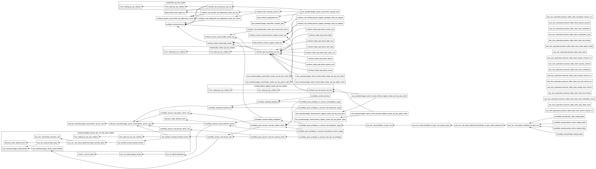

#  Apache Flink v2.1 Kickstarter
This project demonstrates the **real-world power of Apache Flink**—a distributed stream processing engine built for **low-latency, high-throughput, and exactly-once stateful computation**. As a core component of the **signalRoom technology stack**, it highlights how Flink’s advanced features—such as event-time semantics, checkpointing, watermarks, and dynamic scaling—can be leveraged to build resilient, production-grade streaming pipelines. Staying true to our mission of **empowering developers through practical, open knowledge**, this project extends the concepts from our *["Building Apache Flink Applications in Java"](https://developer.confluent.io/courses/flink-java/overview/)* series into runnable, end-to-end examples that showcase how to design, deploy, and optimize Flink jobs for real business impact.

Embarking on this journey, you'll explore how Flink seamlessly integrates with modern data infrastructures, including **Confluent Cloud for Apache Flink**, **AWS Secrets Manager**, **AWS Systems Manager Parameter Store**, and **Apache Iceberg tables in Snowflake**. This project not only illustrates Flink's capabilities in handling complex event processing and state management but also demonstrates best practices for secure configuration management and scalable data storage.


Flink App|Description
-|-
`Data Generator App`|This Apache Flink application simulates realistic flight activity for the fictional airlines **Sunset Air** and **Sky One Airlines**, showcasing seamless integration across modern data streaming technologies. Using Flink’s high-throughput processing capabilities, flight events are continuously published to dedicated **Kafka topics** (`airline.sunset` and `airline.skyone`), enabling real-time monitoring, transformation, and analytics. In parallel, the same synthetic data is written to **Apache Iceberg tables** (`apache_kickstarter.airlines.sunset_airline` and `apache_kickstarter.airlines.skyone_airline`) stored in **AWS S3**, creating a unified, scalable foundation for both streaming and historical analysis.  Built entirely in **Java**, this implementation overcomes current [**PyFlink**](https://nightlies.apache.org/flink/flink-docs-master/docs/dev/python/overview/) limitations—namely, the absence of a Python-native data generator source—while demonstrating best practices for stateful stream processing and unified batch/stream architecture. The result is a powerful, extensible data pipeline that bridges **real-time event processing** and **analytical persistence**, illustrating how Flink can serve as the backbone of next-generation streaming systems.
`Flight Consolidator App`|This Apache Flink application ingests flight event data from the **`airline.sunset`** and **`airline.skyone`** Kafka topics, transforms and standardizes the records into a unified **`airline.flight`** Kafka topic, and persists them to the **`apache_kickstarter.airlines.flight`** Apache Iceberg table. Implemented in both **Java** and **Python**, it demonstrates cross-language stream processing, schema unification, and seamless integration between Kafka, Flink, and Iceberg for end-to-end real-time and analytical data workflows.
`Flyer Stats App`|This Apache Flink application consumes flight event data from the **`airline.flight`** Kafka topic, performs real-time aggregations to compute **flyer-level statistics**, and publishes the results to the **`airline.flyer_stats`** Kafka topic as well as the **`apache_kickstarter.airlines.flyer_stats`** Apache Iceberg table. Implemented in both **Java** and **Python**, it demonstrates how to build unified, stateful streaming and analytical pipelines for continuous aggregation and historical insight.

Originally created by [**Wade Waldron**](https://www.linkedin.com/in/wade-waldron/), *Staff Software Practice Lead at [Confluent Inc.](https://www.confluent.io/)*, these applications are built to showcase **Apache Flink’s enterprise-grade capabilities** through realistic, production-scale scenarios. The workflow begins by **securely retrieving Kafka Cluster and Schema Registry API keys** from **AWS Secrets Manager**, followed by loading essential **Kafka client configuration parameters** from **AWS Systems Manager Parameter Store**. This design highlights best practices for **secure, automated configuration management** and **real-world Flink integration across AWS and Confluent Cloud environments**.

We go beyond simple transformation and enrichment — this project **streams data into Kafka topics and *Apache Iceberg Tables***, purpose-built for **high-performance, large-scale analytics**. Iceberg brings **ACID compliance**, schema evolution, and **highly scalable, real-time data processing with durable storage**, forming the analytical backbone of this architecture.

Our exploration of **Apache Flink** extends beyond Java into **Python-based applications**, showcasing the power of **Flink SQL**, **Table API**, and **DataFrame API**. Each serves a distinct purpose:

* **Flink SQL** for declarative, real-time analytics
* **Table API** for a blend of SQL expressiveness and programmatic control
* **DataFrame API** for efficient, pandas-like data manipulation

Together, they deliver a **unified, flexible, and scalable approach** to solving complex streaming challenges—bridging real-time and batch processing with elegance and performance.

Run the Docker containers (fully compatible with both **Apple Silicon (M-series)** and **x86 architectures**) and experience firsthand how Apache Flink can power **robust, enterprise-grade streaming applications** that are as practical as they are powerful.

**Table of Contents**

<!-- toc -->
+ [**1.0 Are these examples better described as Flink Jobs or Flink Applications-—and why does the distinction matter?**](#10-are-these-examples-better-described-as-flink-jobs-or-flink-applications-and-why-does-the-distinction-matter)
+ [**2.0 Let's get started!**](#20-lets-get-started)
    - [**2.1 What You’ll Learn**](#21-what-youll-learn)
    - [**2.2 Beyond Kafka: Iceberg Integration**](#22-beyond-kafka-iceberg-integration)
    - [**2.3 Run It Locally — Fast**](#23-run-it-locally--fast)
    - [**2.4 Dive In**](#24-dive-in)
    - [**2.5 Getting Started**](#25-getting-started)
        * [**2.5.1 Cloud Prerequisites**](#251-cloud-prerequisites)
        * [**2.5.2 Local Prerequisites**](#252-local-prerequisites)
        * [**2.5.3 Clone the Repository**](#253-clone-the-repository)
        * [**2.5.4 Set Up Your Environment**](#254-set-up-your-environment)
        * [**2.5.5 Run Flink Locally**](#255-run-flink-locally)
        * [**2.5.6 You're Ready!**](#256-youre-ready)
    - [**2.6 DevOps in Action: Running Terraform Locally**](#26-devops-in-action-running-terraform-locally)
        * [**2.6.1 Run locally**](#261-run-locally)
    - [**2.7 DevOps in Action: Running Terraform in the cloud**](#27-devops-in-action-running-terraform-in-the-cloud)
        * [**2.7.1 Run from the cloud**](#271-run-from-the-cloud)
    - [**2.8 Visualizing the Terraform Configuration**](#28-visualizing-the-terraform-configuration)
+ [**3.0 Hands-On Kickoff: Practical Examples for Rapid Learning**](#30-hands-on-kickoff-practical-examples-for-rapid-learning)
    - [**3.1 Flink Applications Powered by Java on a locally running Apache Flink Cluster in Docker**](#31-flink-applications-powered-by-java-on-a-locally-running-apache-flink-cluster-in-docker)
    - [**3.2 Flink Applications Powered by Python on a locally running Apache Flink Cluster in Docker**](#32-flink-applications-powered-by-python-on-a-locally-running-apache-flink-cluster-in-docker)
    - [**3.3 Flink Applications Powered by Python on Confluent Cloud for Apache Flink**](#33-flink-applications-powered-by-python-on-confluent-cloud-for-apache-flink)
+ [**4.0 Powering Analytics with Apache Iceberg tables in Snowflake**](#40-powering-analytics-with-apache-iceberg-tables-in-snowflake)
+ [**5.0 Resources**](#50-resources)
<!-- tocstop -->

## **1.0 Are these examples better described as Flink Jobs or Flink Applications-—and why does the distinction matter?**

> _"What's in a name? That which we call a rose by any other name would smell just as sweet."_
>
> -- _William Shakespeare_

**Did you know?** In the Flink ecosystem, what many call “jobs” are actually better described as **Flink applications**—and that distinction matters.

A Flink application isn’t just a single computation or stream transformation—it’s a **self-contained, event-driven system** that coordinates state management, fault tolerance, and complex dataflows across distributed clusters. In essence, each one is a **mini software ecosystem**, designed to solve real-world data challenges at scale.

By calling them *applications*, we highlight their **depth, sophistication, and architectural completeness**. They don’t just process data—they **model business logic, orchestrate stateful workflows, and power streaming intelligence** much like any robust production-grade software system.

*(Curious why the terminology matters? Check out the rationale [here](.blog/rationale-behind-calling-it-flink-app.md)!)*

## **2.0 Let's get started!**
As of **October 4, 2024**, **Apache Flink on Confluent Cloud** unlocks incredible potential for real-time stream processing—along with a few key nuances developers should know.  Currently, **Flink on Confluent Cloud** does **not** support the **DataStream API**, and its **Table API** has **limited functionality** (see supported features [here](https://github.com/confluentinc/flink-table-api-python-examples?tab=readme-ov-file#supported-api)), supporting Java and Python-based Flink applications. But don’t worry—**this repository bridges those gaps** with practical, production-ready examples.

#### **2.1 What You’ll Learn**
In this repo, you’ll find **Java-based examples using the Flink DataStream API** to go beyond Flink’s standard capabilities—like:

* Securely retrieving **Kafka Cluster API keys** from **AWS Secrets Manager**
* Dynamically loading **Kafka client configuration** from **AWS Systems Manager Parameter Store**
  —all directly integrated within a running Flink job.

Prefer Python? You’re covered there too. Using the **Flink Table API** and **User-Defined Table Functions (UDTFs)**, you can achieve the same secure, dynamic configuration loading while staying fully in Python.

#### **2.2 Beyond Kafka: Iceberg Integration**

We don’t just stream data into Kafka topics—this project also demonstrates how to **sink data into Apache Iceberg tables**, combining **real-time event streaming** with **durable, analytical storage** for hybrid batch/stream processing.
#### **2.3 Run It Locally — Fast**
Spin up an **Apache Flink 2.1.0 cluster locally** in minutes using Docker—fully compatible with both **Apple Silicon (M-series)** and **x86 machines**. The Flink cluster connects seamlessly to **Confluent Cloud** for Kafka and Schema Registry resources, giving you a realistic, end-to-end development environment.

#### **2.4 Dive In**
Explore the examples, run the containers, and see how to build **secure, scalable, enterprise-grade Flink applications** that push the limits of what’s possible with modern data streaming.
The future of real-time data pipelines starts here.

#### **2.5 Getting Started**
Follow these steps to set up your environment and launch the complete **Apache Flink Kickstarter** stack—locally or in the cloud.

##### **2.5.1 Cloud Prerequisites**

Before you begin, ensure you have access to the following cloud accounts:

* **[AWS Account](https://signin.aws.amazon.com/)** — with **SSO configured**
* **[Confluent Cloud Account](https://confluent.cloud/)** — for Kafka and Schema Registry resources
* **[Docker Account](https://docker.com)** — to pull and run containers
* **[GitHub Account](https://github.com)** — with **OIDC configured** for AWS authentication
* **[Snowflake Account](https://app.snowflake.com/)** — for data warehousing and analytics
* **[Terraform Cloud Account](https://app.terraform.io/)** — for automated infrastructure provisioning

##### **2.5.2 Local Prerequisites**

Make sure the following tools are installed on your local machine:

* **[AWS CLI version 2](https://docs.aws.amazon.com/cli/latest/userguide/getting-started-install.html)**
* **[Confluent CLI version 4 or higher](https://docs.confluent.io/confluent-cli/4.0/overview.html)**
* **[Docker Desktop](https://www.docker.com/products/docker-desktop/)**
* **[Java JDK 21](https://www.oracle.com/java/technologies/javase/jdk21-archive-downloads.html)**
* **[Python 3.12](https://www.python.org/downloads/release/python-3120/)**
* **[Terraform CLI version 1.13.4](https://developer.hashicorp.com/terraform/install)**

##### **2.5.3 Clone the Repository**

```bash
git clone https://github.com/j3-signalroom/apache_flink-kickstarter.git
cd apache_flink-kickstarter
```

##### **2.5.4 Set Up Your Environment**

You can set up the complete environment in one of two ways:

* **Option A:** Configure and run **Terraform Cloud** locally.
* **Option B:** Use **GitHub Actions** to automatically create all resources.

Both methods provision a fully functional **end-to-end data streaming architecture**, including:

* A **Confluent Cloud environment** with a Kafka cluster and pre-configured example topics
* **AWS Secrets Manager** for secure Kafka API key storage
* **AWS Systems Manager Parameter Store** for Kafka client configuration (consumer/producer properties)
* An **AWS S3 bucket** with a dedicated `warehouse/` folder serving as the **landing zone for Apache Iceberg Tables**—populated by two Python-based Flink applications

##### **2.5.5 Run Flink Locally**

You can run **Apache Flink** locally on your Mac or use the **provided Docker containers** to launch Flink and Iceberg seamlessly—compatible with both **Apple Silicon (M-series)** and **x86 architectures**.

##### **2.5.6 You're Ready!**

Once deployed, you’ll have a **complete enterprise-grade data streaming environment**—secure, scalable, and ready to power both **real-time** and **analytical** use cases.

#### **2.6 DevOps in Action: Running Terraform Locally**
Install the [Terraform CLI](https://developer.hashicorp.com/terraform/tutorials/aws-get-started/install-cli) on your local machine, and make sure you have an [HCP Terraform account](https://app.terraform.io/session) to run the Terraform configuration.  Learn how to set up Terraform Cloud for local use by clicking [here](.blog/setup-terraform-cloud.md).

##### **2.6.1 Run locally**
```bash
./deploy-terraform.sh <create | delete> --profile=<SSO_PROFILE_NAME>
                                        --confluent-api-key=<CONFLUENT_API_KEY>
                                        --confluent-api-secret=<CONFLUENT_API_SECRET>
                                        --snowflake-warehouse=<SNOWFLAKE_WAREHOUSE>
                                        --service-account-user=<SERVICE_ACCOUNT_USER>
                                        --day-count=<DAY_COUNT>
                                        --auto-offset-reset=<earliest | latest>
                                        --number-of-api-keys-to-retain=<NUMBER_OF_API_KEYS_TO_RETAIN>
                                        --admin-service-user-secrets-root-path=<ADMIN_SERVICE_USER_SECRETS_ROOT_PATH>
```
> Argument placeholder|Replace with
> -|-
> `<SSO_PROFILE_NAME>`|your AWS SSO profile name for your AWS infrastructue that host your AWS Secrets Manager.
> `<CONFLUENT_API_KEY>`|your organization's Confluent Cloud API Key (also referred as Cloud API ID).
> `<CONFLUENT_API_SECRET>`|your organization's Confluent Cloud API Secret.
> `<SNOWFLAKE_WAREHOUSE>`|the Snowflake warehouse (or "virtual warehouse") you choose to run the resources in Snowflake.
> `<SERVICE_ACCOUNT_USER>`|the Snowflake service account user who is to be assigned the RSA key pairs for its authentication.
> `<DAY_COUNT>`|how many day(s) should the API Key be rotated for.
> `<AUTO_OFFSET_RESET>`|Use `earliest`, when you want to read the first event in a Kafka topic.  Otherwise, specify `latest`.
> `<NUMBER_OF_API_KEYS_TO_RETAIN>`|Specifies the number of API keys to create and retain.
> `<ADMIN_SERVICE_USER_SECRETS_ROOT_PATH>`|the root path in AWS Secrets Manager for admin service user secrets.

To learn more about this script, click [here](.blog/deploy-terraform-script-explanation.md).

#### **2.7 DevOps in Action: Running Terraform in the cloud**
In order to run the Terraform configuration from GitHub, the Terraform Cloud API token and Confluent Cloud API Key are required as GitHub Secret variables.  Learn how to do to get the Terraform Cloud API token and Confluent Cloud API key [here](.blog/setup-github.md).

##### **2.7.1 Run from the cloud**
Follow these steps:

a. **Deploy the Repository**: Ensure that you have cloned or forked the repository to your GitHub account.

b. **Set Required Secrets and Variables**: Before running any of the GitHub workflows provided in the repository, you must define at least the `AWS_DEV_ACCOUNT_ID` variable (which should contain your AWS Account ID for your development environment). To do this:

- Go to the **Settings** of your cloned or forked repository in GitHub.

- Navigate to **Secrets and Variables** > **Actions**.

- Add the `AWS_DEV_ACCOUNT_ID` and any other required variables or secrets.

c. **Navigate to the Actions Page**:

- From the cloned or forked repository on GitHub, click on the **Actions** tab.

d. **Select and Run the Deploy Workflow**:

- Find the **Deploy workflow** link on the left side of the Actions page and click on it.

    

- On the **Deploy workflow** page, click the **Run workflow** button.

- A workflow dialog box will appear. Fill in the necessary details and click **Run workflow** to initiate the Terraform deployment process.

    

By following these steps, you will run the Terraform configuration directly from GitHub, leveraging GitHub Actions for automation and deployment.

#### **2.8 Visualizing the Terraform Configuration**
Below is the Terraform visualization of the Terraform configuration.  It shows the resources and their dependencies, making the infrastructure setup easier to understand.



> **To fully view the image, open it in another tab on your browser to zoom in.**

When you update the Terraform Configuration, to update the Terraform visualization, use the [`terraform graph`](https://developer.hashicorp.com/terraform/cli/commands/graph) command with [Graphviz](https://graphviz.org/) to generate a visual representation of the resources and their dependencies.  To do this, run the following command:

```bash
terraform graph | dot -Tpng > .blog/images/terraform-visualization.png
```

## **3.0 Hands-On Kickoff: Practical Examples for Rapid Learning**

### **3.1 Flink Applications Powered by Java on a locally running Apache Flink Cluster in Docker**
[Let's go!](java/README.md)

### **3.2 Flink Applications Powered by Python on a locally running Apache Flink Cluster in Docker**
[Let's go!](python/README.md)

### **3.3 Flink Applications Powered by Python on Confluent Cloud for Apache Flink**
[Let's go!](ccaf/README.md)

## **4.0 Powering Analytics with Apache Iceberg tables in Snowflake**
After running the Flink applications, you can now leverage the data stored in the Apache Iceberg tables in Snowflake for analytics.  Click [here](.blog/using-non-managed-apache-iceberg-tables-in-snowflake.md) to learn more about using **Non-Managed Apache Iceberg tables** in Snowflake.  This blog post will help you understand the trade-offs, operational characteristics, and integration patterns of using Apache Iceberg tables in Snowflake.  These terraform configurations:

- [aws-iam-snowflake-setup](aws-iam-snowflake-setup.tf) - creates the necessary Snowflake IAM roles and policies in AWS to get started.
- [snowflake-non-managed-apache-iceberg-table-privileges-setup](snowflake-non-managed-apache-iceberg-table-privileges-setup.tf) - grants the necessary privileges to the Snowflake resources to get started.
- [snowflake-non-managed-apache-iceberg-table-setup](snowflake-non-managed-apache-iceberg-table-setup.tf) - creates the necessary resources in Snowflake to get started.

## **5.0 Resources**

[Apache Flink's Core is Dataflow Programming](https://en.wikipedia.org/wiki/Dataflow_programming)

[What is Apache Flink? — Architecture](https://flink.apache.org/what-is-flink/flink-architecture/)

[Apache Flink Use Cases](https://flink.apache.org/what-is-flink/use-cases/)

[Building Apache Flink Applications in Java](https://developer.confluent.io/courses/flink-java/overview/)

[J3's techStack Lexicon](https://github.com/j3-signalroom/j3-techstack-lexicon/blob/main/README.md)

[Unlocking Schema Registry Access: Granting Confluent Service Account Permissions with Terraform](.blog/unlocking-schema-registry-access.md)
