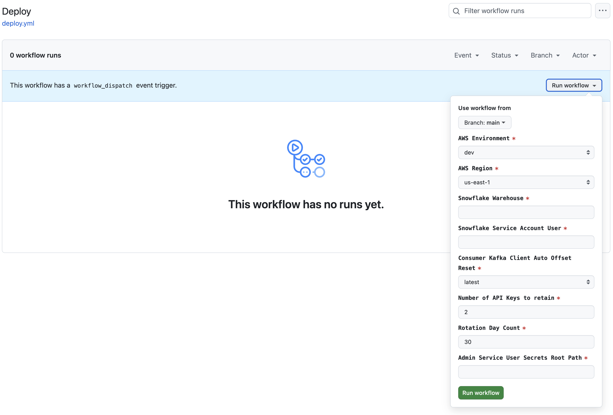

# Apache Flink Kickstarter

To kickstart your journey in the wonderful world that the creators of Apache Flink have created for us all.  J3 started with the three primary DataStream apps from the blog series on [Building Apache Flink Applications in Java](https://developer.confluent.io/courses/flink-java/overview/):

App|Description
-|-
`DataGeneratorApp`|This app creates fake flight data for fictional airlines **Sunset Air** and **Sky One** Airlines," and sends it to the Kafka topics `airline.sunset` and `airline.skyone` respectively.
`FlightImporterApp`|This app imports flight data from `airline.sunset` and `airline.skyone` Kafka topics and converts it to a unified format for the `airline.all` Kafka topic.
`UserStatisticsApp`|This app processes data from the `airline.all` Kafka topic to aggregate user statistics in the `airline.user_statistics` Kafka topic.

 Created by [Wade Waldron](https://www.linkedin.com/in/wade-waldron/), Staff Software Practice Lead at [Confluent Inc.](https://www.confluent.io/), and adapted to showcase one best practice and three additional capabilities:

No.|Best Practice/Capability|Description
-|-|-
1.|DevOps Infrastructure as Code (IaC)|As a best practice, we utilize GitHub Workflow/Actions and Terraform Cloud to automate the creation and teardown of the Confluent Cloud and AWS resources for you.
2.|Read AWS Secrets Manager and AWS Systems Manager Parameter Store|Instead of relying on the local consumer and producer properties file, the Kafka Cluster API Key, and Kafka Consumer and Kafka Producer client configuration properties are read from the AWS Secrets Manager and AWS Systems Manager Parameter Store.
3.|Custom Source Data Stream|An Apache Flink custom source data stream is a user-defined source of data that is integrated into a Flink application to read and process data from non-standard or custom sources. This custom source can be anything that isn't supported by Flink out of the box, such as proprietary REST APIs, specialized databases, custom hardware interfaces, etc. J3 utilizes a Custom Source Data Stream to read the AWS Secrets Manager secrets and AWS Systems Manager Parameter Store properties during the initial start of a App, then caches the properties for use by any subsequent events that need these properties.
4.|Sinking to Apache Iceberg **(COMING SOON)**|The combination of Apache Flink and Apache Iceberg provides several advantages. Iceberg’s capabilities, including snapshot isolation for reads and writes, the ability to handle multiple concurrent operations, ACID-compliant queries, and incremental reads, enable Flink to perform operations that were traditionally challenging with older table formats. Together, they offer an efficient and scalable platform for processing large-scale data, especially for streaming use cases.

**Table of Contents**

<!-- toc -->
+ [1.0 What do we call these examples, Flink Jobs or Flink Applications?](#10-what-do-we-call-these-examples-flink-jobs-or-flink-applications)
+ [2.0 Let's get started](#20-lets-get-started)
    - [2.1 DevOps in Action with Terraform ran locally](#21-devops-in-action-with-terraform-ran-locally)
        + [2.1.1 Run Terraform locally](#211-run-terraform-locally)
    - [2.2 DevOps in Action with GitHub, running Terraform in the cloud](#22-devops-in-action-with-github-running-terraform-in-the-cloud)
        + [2.2.1 Deploy Terraform from the cloud](#221-deploy-terraform-from-the-cloud)
    - [2.3 Power up the Apache Flink Docker containers](#23-power-up-the-apache-flink-docker-containers)
+ [3.0 Examples to get you kickstarted!](#30-examples-to-get-you-kickstarted)
    - [3.1 Java Examples](#31-java-examples)
    - [3.2 Python Examples](#32-flink-apps-written-in-python)
+ [4.0 Resources](#40-resources)
<!-- tocstop -->

## 1.0 What do we call these examples, Flink Jobs or Flink Applications?

> _"What's in a name? That which we call a rose by any other name would smell just as sweet."_
>
> -- _William Shakespeare_

Flink jobs are often called Flink applications because they encompass more than just a single task or computation. The term "application" better reflects the nature and scope of what is being developed and executed in Apache Flink.  (See [here](.blog/rationale-behind-calling-it-flink-app.md) for the rationale behind this reasoning.)  By calling Flink jobs "Flink applications," it emphasizes the comprehensive, complex, and integrated nature of the work, aligning it more closely with how we think about and manage software applications in general.

## 2.0 Let's get started

As of August 2024, Confluent’s Serverless Flink offering does not yet support the DataStream API and Table API for creating Flink Apps in Java or Python.  Therefore, this repo restricts the use of cloud resources to the _Confluent Cloud Kafka Cluster and Schema Registry_ only.  It utilizes _AWS Secrets Manager_ to store Kafka Cluster and Schema Registry API Key secrets, _AWS Systems Manager Parameter Store_ to store Consumer and Producer Kafka configuration properties, _AWS S3 Bucket to store Apache Iceberg files in it_, and _Terraform Cloud and GitHub Workflow/Actions for Infrastructure as Code (IaC) DevOps CI/CD_.  Locally, we will utilize Docker containers to run Apache Flink and Apache Iceberg.

**These are the steps**

1. Take care of the cloud and local environment prequisities listed below:
    > You need to have the following cloud accounts:
    > - [AWS Account](https://signin.aws.amazon.com/) *with SSO configured*
    > - [Confluent Cloud Account](https://confluent.cloud/)
    > - [Docker Account](https://docker.com)
    > - [GitHub Account](https://github.com) *with OIDC configured for AWS*
    > - [Snowflake Account](https://app.snowflake.com/)
    > - [Terraform Cloud Account](https://app.terraform.io/) *with OIDC configured for GitHub*
    > 
    > You need to have the following installed on your local machine:
    > - [AWS CLI version 2](https://docs.aws.amazon.com/cli/latest/userguide/getting-started-install.html)
    > - [Confluent CLI version 3 or higher](https://docs.confluent.io/confluent-cli/4.0/overview.html)
    > - [Docker Desktop](https://www.docker.com/products/docker-desktop/)
    > - [Java JDK (Java Development Kit) 11](https://www.oracle.com/java/technologies/javase/jdk11-archive-downloads.html)
    > - [Python 3.11](https://www.python.org/downloads/release/python-3119/)
    > - [Terraform CLI version 1.85 or higher](https://developer.hashicorp.com/terraform/install)

2. Clone the repo:
    ```shell
    git clone https://github.com/j3-signalroom/apache_flink-kickstarter.git
    ```

3. Set up your Terraform Cloud environment locally, or use [GitHub workflow/actions](.github/workflows/deploy.yml), so you can:

    - Have your Confluent Cloud environment with a Kafka Cluster that uses the example Kafka topics and their schemas in the Schema Registry set up for you.

    - Have your AWS Secrets Manager store API Key Secrets for Kafka Cluster and Schema Registry Cluster, along with the Kafka properties for Consumer and Producer, in the AWS Systems Parameter Store, set up for you.  An AWS S3 Bucket is also created as the landing spot for the Apache Iceberg files generated by the Flink Apps (a.k.a. Flink Jobs).

4. Run Apache Flink on your Mac locally, or Power up the Docker containers that run Apache Flink and Apache Iceberg locally on your machine.

### 2.1 DevOps in Action with Terraform ran locally
Install the [Terraform CLI](https://developer.hashicorp.com/terraform/tutorials/aws-get-started/install-cli) on your local machine, and make sure you have an [HCP Terraform account](https://app.terraform.io/session) to run the Terraform configuration.  Learn how to set up Terraform Cloud for local use by clicking [here](.blog/setup-terraform-cloud.md).

#### 2.1.1 Run Terraform locally
```shell
scripts/run-terraform-locally.sh --environment=<ENVIRONMENT_NAME> --profile=<PROFILE_NAME> --confluent_cloud_api_key=<CONFLUENT_CLOUD_API_KEY> --confluent_cloud_api_secret=<CONFLUENT_CLOUD_API_SECRETS> 
```

### 2.2 DevOps in Action with GitHub, running Terraform in the cloud
In order to run the Terraform configuration from GitHub, the Terraform Cloud API token and Confluent Cloud API Key are required as GitHub Secret variables.  Learn how to do to get the Terraform Cloud API token and Confluent Cloud API key [here](.blog/setup-github.md).

#### 2.2.1 Deploy Terraform from the cloud
From the repo on GitHub, go to [GitHub Actions](https://github.com/j3-signalroom/apache_flink-kickstarter/actions), for instance (see screenshot below):


Click the `Deploy` workflow, and the Deploy page will be displayed (see screenshot below):


Click `Run workflow` button, and the Deploy dialog box will be displayed (see screenshot below):



Then fill out the Deploy dialog box, and click the `Run workflow` button to deploy the Terraform configuration.

### 2.3 Power up the Apache Flink Docker containers

> **Prerequisite**
> 
> Before you can run `scripts/run-flink-locally.sh` Bash script, you need to install the [`aws2aws2-wrap`](https://pypi.org/project/aws2-wrap/#description) utility.  If you have a Mac machine, run this command from your Terminal:
> ````shell
> brew install aws2-wrap
> ````
>
> Or, make sure you have Python3.x installed on your machine, and run this command from your Terminal:
> ```shell
> pip install aws2-wrap
> ```

This section guides you through the local setup (on one machine but in separate containers) of the Apache Flink cluster in Session mode using Docker containers with support for Apache Iceberg.  Run the `bash` script below to start the Apache Flink cluster in Session Mode on your machine:

> *If you are running Docker on a Mac with M1, M2, or M3 chip, set the `--chip` argument to `--chip=arm64`.  Otherwise, set it to `--chip=amd64`.  As for the `--profile` argument, specify your AWS SSO Profile Name (e.g., `--profile=AdministratorAccess-0123456789`.*

```shell
scripts/run-flink-locally.sh --profile=<AWS_SSO_PROFILE_NAME> --chip=<amd64 | arm64>
```

## 3.0 Examples to get you kickstarted!

### 3.1 Flink Apps written in Java
[Let's get started!](java/README.md)

### 3.2 Flink Apps written in Python
[Let's get started!](python/README.md)

## 4.0 Resources

[Apache Flink's Core is Dataflow Programming](https://en.wikipedia.org/wiki/Dataflow_programming)

[What is Apache Flink? — Architecture](https://flink.apache.org/what-is-flink/flink-architecture/)

[Apache Flink Use Cases](https://flink.apache.org/what-is-flink/use-cases/)

[Building Apache Flink Applications in Java](https://developer.confluent.io/courses/flink-java/overview/)

[J3's techStack Lexicon](https://github.com/j3-signalroom/j3-techstack-lexicon/blob/main/README.md)
