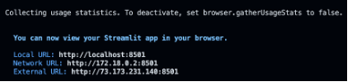

# Flink Applications Powered by Python
Discover how Apache Flink® can transform your data pipelines! Explore hands-on examples of Flink applications using the [DataStream API](https://nightlies.apache.org/flink/flink-docs-release-1.19/docs/dev/python/datastream/intro_to_datastream_api/), [Table API](https://nightlies.apache.org/flink/flink-docs-release-1.19/docs/dev/python/table/intro_to_table_api/), and [Flink SQL](https://nightlies.apache.org/flink/flink-docs-release-1.19/docs/dev/table/sql/overview/#sql)—all built in Python with PyFlink, which compiles these apps to Java. You'll see how these technologies integrate seamlessly with AWS Services, Apache Kafka, and  Apache Iceberg.

Curious about the differences between the DataStream API and Table API? Click [here](../.blog/datastream-vs-table-api.md) to learn more and find the best fit for your next project.

**Table of Contents**

<!-- toc -->
+ [1.0 Important Note(s)](#10-important-notes)
+ [2.0 Power up the Apache Flink Docker containers](#20-power-up-the-apache-flink-docker-containers)
+ [3.0 Discover What You Can Do with These Flink Apps](#30-discover-what-you-can-do-with-these-flink-apps)
    - [3.1 Special Mention](#31-special-mention)
+ [4.0  Unleash the Full Power of Flink to Bring Your Data Visualizations to Life!](#40-unleash-the-full-power-of-flink-to-bring-your-data-visualizations-to-life)
    - [4.1 Have you noticed something curious about this example?](#41-have-you-noticed-something-curious-about-this-example)
+ [5.0 Resources](#50-resources)
<!-- tocstop -->

## 1.0 Important Note(s)
> As previously mentioned, PyFlink does not have a built-in Python-based data generator source for creating data streams. Therefore, before executing any of the Flink applications, it is necessary to pre-populate the Kafka topics `airline.skyone` and `airline.sunset` with data. To achieve this, run the Java-based Flink application named [`DataGeneratorApp`](../java/README.md) first, which is designed to generate sample records and populate these Kafka topics with the necessary data. This step ensures that subsequent Flink applications have data to work with and can properly perform their intended operations.

## 2.0 Power up the Apache Flink Docker containers

> **Prerequisite**
> 
> Before you can run `scripts/run-flink-locally.sh` Bash script, you need to install the [`aws2-wrap`](https://pypi.org/project/aws2-wrap/#description) utility.  If you have a Mac machine, run this command from your Terminal:
> ````bash
> brew install aws2-wrap
> ````
>
> If you do not, make sure you have Python3.x installed on your machine, and run this command from your Terminal:
> ```bash
> pip install aws2-wrap
> ```

This section guides you through the local setup (on one machine but in separate containers) of the Apache Flink cluster in Session mode using Docker containers with support for Apache Iceberg.  Run the `bash` script below to start the Apache Flink cluster in Session Mode on your machine:

```bash
scripts/run-flink-locally.sh on --profile=<AWS_SSO_PROFILE_NAME>
                                --chip=<amd64 | arm64>
                                --flink-language=python
                                [--aws-s3-bucket=<AWS_S3_BUCKET_NAME>]
```
> Argument placeholder|Replace with
> -|-
> `<ACTIVATE_DOCKER_CONTAINER>`|`on` to turn on Flink locally, otherwise `off` to turn Flink off.
> `<AWS_SSO_PROFILE_NAME>`|your AWS SSO profile name for your AWS infrastructue that host your AWS Secrets Manager.
> `<CHIP>`|if you are running on a Mac with M1, M2, or M3 chip, use `arm64`.  Otherwise, use `amd64`.
> `<FLINK_LANGUAGE>`|`python` to specify Python is the language base of the Flink Apps you plan on running.  Otherwise, specifiy `java` if the language base of the Flink Apps are Java.
> `<AWS_S3_BUCKET_NAME>`|**[Optional]** can specify the name of the AWS S3 bucket used to store Apache Iceberg files.

To learn more about this script, click [here](../.blog/run-flink-locally-script-explanation.md).

## 3.0 Discover What You Can Do with These Flink Apps
To access the Flink JobManager (`apache_flink-kickstarter-jobmanager-1`) container, open the interactive shell by running:
```bash
docker exec -it -u root -w /opt/flink/python_apps/src apache_flink-kickstarter-jobmanager-1 /bin/bash
```

Jump right into the container and take charge! You’ll have full control to run commands, explore the file system, and tackle any tasks you need. You’ll land directly in the `/opt/flink/python_apps` directory—this is the headquarters for all the Python scripts in the repo.

Ready to launch one of those cool Java-to-Python Flink apps? Just use the [`flink run`](https://nightlies.apache.org/flink/flink-docs-master/docs/deployment/cli/) command with the correct options, and kick off the Python Flink app script with its corresponding parameters below. Adventure awaits!

Flink App|Flink Run Command
-|-
**`FlightImporterApp`**|`uv run flink run --pyFiles kickstarter/python_files.zip --python kickstarter/flight_importer_app.py --aws-s3-bucket <AWS_S3_BUCKET> --aws-region <AWS_REGION_NAME>`
**`FlyerStatsApp`**|`uv run flink run --pyFiles kickstarter/python_files.zip --python kickstarter/flyer_stats_app.py --aws-s3-bucket <AWS_S3_BUCKET> --aws-region <AWS_REGION_NAME>`

> Argument placeholder|Replace with
> -|-
> `<AWS_S3_BUCKET>`|specify name of the AWS S3 bucket you chosen during the Terraform creation or created yourself separately.  The AWS S3 bucket is used to store the Apache Iceberg files (i.e., data files, manifest files, manifest list file, and metadata files).
> `<AWS_REGION_NAME>`|specify the AWS Region your AWS Glue infrastructure resides.

### 3.1 Special Mention
Before we move on, take a moment to notice something new right before the `flink run` command—the `uv` run comes right before it! What is `uv`, you ask? Well, it's an incredibly fast Python package installer and dependency resolver, written in Rust, and designed to seamlessly replace `pip` and pip-tools in your workflows. By prefixing uv run to a command, you're ensuring that the command runs in an optimal Python environment.

Now, let's break down the magic behind uv run:
- When you use it with a file ending in `.py` or an HTTP(S) URL, uv treats it as a script and runs it with a Python interpreter. In other words, `uv run` `file.py` is equivalent to `uv` run python file.py. If you're working with a URL, `uv` even downloads it temporarily to execute it. Any inline dependency metadata is installed into an isolated, temporary environment—meaning zero leftover mess! When used with `-`, the input will be read from `stdin`, and treated as a Python script.
- If used in a project directory, uv will automatically create or update the project environment before running the command.
- Outside of a project, if there's a virtual environment present in your current directory (or any parent directory), uv runs the command in that environment. If no environment is found, it uses the interpreter's environment.

So what does this mean when we put `uv` run before `flink run`? It means uv takes care of all the setup—fast and seamless—right on the Flink cluster. If you think AI/ML is magic, the work the folks at Astral have done with uv is pure wizardry!

Curious to learn more about Astral's `uv`? Check these out:
- Documentation: Learn about [uv](https://docs.astral.sh/uv/).
- Video: [uv IS the Future of Python Packing!](https://www.youtube.com/watch?v=8UuW8o4bHbw).

## 4.0 Unleash the Full Power of Flink to Bring Your Data Visualizations to Life!
The exciting part is that after running all your Flink applications, the data now flows seamlessly into your Kafka Topics and Apache Iceberg Tables. But data alone doesn’t tell the story—it’s time to share those insights with the world! One fantastic way to do that is with Streamlit, which allows you to easily create interactive visualizations. Streamlit is intuitive, powerful, and designed with Python developers in mind, making it a breeze to turn raw data into captivating dashboards. 😉


To illustrate, I created a Streamlit script that queries the `apache_kickstarter.airlines.flight` Apache Iceberg Table, harnessing Flink SQL to extract valuable insights. These insights are then brought to life through a Streamlit dashboard, transforming raw data into an accessible, visual experience.

Here you go, run this in the docker container terminal command line:

```bash
uv run streamlit run kickstarter/local_flink_streamlit.py -- --aws-s3-bucket <AWS_S3_BUCKET> --aws-region <AWS_REGION_NAME>
```
> _Notice the extra `--` between streamlit run `kickstarter/local_flink_streamlit.py` and the actual script arguments.  This is necessary to pass arguments to the Streamlit script without causing conflicts with Streamlit's own CLI options._

When you run the script, for instance, it produces the following output:



Open your host web browser, enter the local URL, `localhost:8501`, and in a few moments this web page will be displayed:


> _**"After many years in this industry, I’m still amazed by what we can achieve today!  The possibilities are endless—enjoy the ride!"**_
> 
> _**---J3**_

### 4.1 Have you noticed something curious about this example?
When running Streamlit in this example with Apache Flink, Streamlit runs the Python script that uses PyFlink instead of submitting the Python script to the Flink cluster using the `flink run` CLI command.  The difference between the two approaches lies in the execution environment, resource utilization, and integration with the Flink cluster.   _**Stay tuned for the write-up on the different approaches and the code example that handles the approach of what to do if Flink is remote.**_	

## 5.0 Resources

[Flink Python Docs](https://nightlies.apache.org/flink/flink-docs-master/api/python/)

[PyFlink API Reference](https://nightlies.apache.org/flink/flink-docs-release-1.20/api/python/reference/index.html)

[Apache Flink® Table API on Confluent Cloud - Examples](https://github.com/confluentinc/flink-table-api-python-examples)

[How to create a User-Defined Table Function (UDTF) in PyFlink to fetch data from an external source for your Flink App?](../.blog/how-create-a-pyflink-udtf.md)