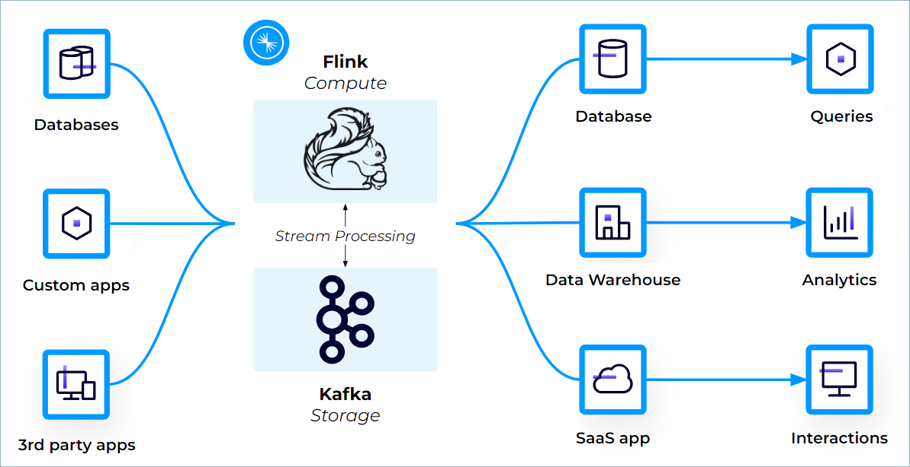

# Flink Applications Powered by Python on Confluent Cloud for Apache Flink (CCAF)
[Confluent Cloud for Apache Flink (CCAF)](https://docs.confluent.io/cloud/current/flink/overview.html) provides a cloud-native, serverless service for Flink that enables simple, scalable, and secure stream processing that integrates seamlessly with Apache Kafka®. Your Kafka topics appear automatically as queryable Flink tables, with schemas and metadata attached by Confluent Cloud.



Confluent Cloud for Apache Flink supports creating stream-processing applications by using Flink SQL, the [Flink Table API](https://docs.confluent.io/cloud/current/flink/reference/table-api.html#flink-table-api) (Java and Python), and custom [user-defined functions](https://docs.confluent.io/cloud/current/flink/concepts/user-defined-functions.html#flink-sql-udfs).

**Table of Contents**

<!-- toc -->
+ [1.0 Interact with the CCAF Table API locally](#10-interact-with-the-ccaf-table-api-locally)
+ [2.0 Deploying Apache Flink Applications on Confluent Cloud’s Fully Managed Platform](#20-deploying-apache-flink-applications-on-confluent-clouds-fully-managed-platform)
  * [2.1 Avro formatted data](#21-avro-formatted-data)
+ [3.0 Resources](#30-resources)
<!-- tocstop -->


## 1.0 Interact with the CCAF Table API locally

1. Change to the `python_ccaf` directory:

    ```bash
    cd python_ccaf
    ```

2. To interact with the CCAF Table API locally, start a shell within the poetry virtualenv:

    ```bash
    poetry shell
    ```

3. Then start Python in interactive mode with CCAF Table API:

    ```bash
    python -i setup_pyshell.py
    ```

4. The `TableEnvironment` is pre-initialized from environment variables and available under `tbl_env`.

## 2.0 Deploying Apache Flink Applications on Confluent Cloud’s Fully Managed Platform

### 2.1 Avro formatted data
Flink App|Run Script
-|-
**`avro_flight_consolidator_app`**|`../scripts/run-avro-flight-consolidator-ccaf-app-locally.sh --profile=<AWS_SSO_PROFILE_NAME> --service-account-user=<SERVICE_ACCOUNT_USER>`

> Argument placeholder|Replace with
> -|-
> `<AWS_SSO_PROFILE_NAME>`|your AWS SSO profile name for your AWS infrastructue that host your AWS Secrets Manager.
> `<SERVICE_ACCOUNT_USER>`|the Snowflake service account user, that is used in the name of the AWS Secrets Manager secrets path.

## 3.0 Resources
[Table API on Confluent Cloud for Apache Flink](https://docs.confluent.io/cloud/current/flink/reference/table-api.html#table-api-on-af-long)

[Table API in Confluent Cloud for Apache Flink API Function](https://docs.confluent.io/cloud/current/flink/reference/functions/table-api-functions.html#flink-table-api-functions)

[Information Schema in Confluent Cloud for Apache Flink](https://docs.confluent.io/cloud/current/flink/reference/flink-sql-information-schema.html)
